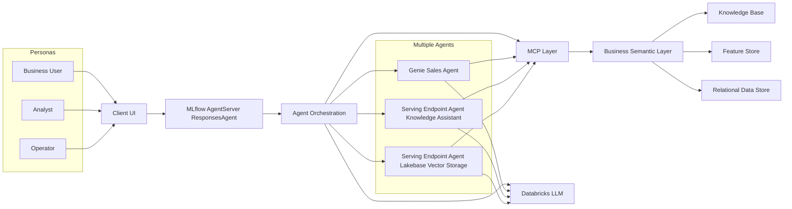

# Multiagent App on Databricks

## MVP Status


| Area | Current maturity | Notes |
| ---- | ---------------- | ----- |
| Routing | MVP | Orchestrates across app agents, Genie, and serving endpoints. |
| Deployment | MVP+ | Databricks Declarative Automation Bundles with dev/qa/stg/prod targets. |
| Observability | Baseline | MLflow tracing and logs are available; SLO dashboards are not fully productized. |
| Security | Baseline | Resource permissions and target-level overrides are defined per environment. |

## Current Status (2026-07-01)

- Dev app is running and user-accessible with Chainlit UI.
- Hosted startup uses `uv run start-app` with runtime port split (frontend public, backend internal) to avoid bind conflicts.
- Bundle validation is healthy for `dev`.
- In this environment, `databricks bundle deploy` can intermittently fail due to Terraform provider registry connectivity.
- Operational rollout fallback is `databricks bundle sync` plus direct `databricks apps deploy` from the bundle source path.
- Genie access dependencies were remediated for dev by granting SQL warehouse `CAN_USE`, catalog/schema usage, and table-level `SELECT`.

## What This Project Does

This repository contains a Databricks-hosted orchestrator agent that routes user requests to multiple backends from one app endpoint.

| Backend | How it is queried | API |
| ------- | ----------------- | --- |
| Another Databricks App agent | DatabricksOpenAI responses client | Responses API |
| Genie space | Databricks MCP integration | MCP |
| Knowledge assistant on serving | DatabricksOpenAI responses client | Responses API |
| General serving endpoint | DatabricksOpenAI responses client | Responses API |

The orchestrator selects tools dynamically based on user intent and the routing instructions in `backend/agent.py`.

## Deployment Diagram



### How To Read This Diagram

- People on the left (Business User, Analyst, Operator) interact with the Client UI.
- The Agent Orchestration service decides which specialist agent(s) should handle each request.
- Agents use the Databricks LLM to reason and generate responses.
- When data is needed, agents and orchestration use MCP to reach the business semantic layer.
- The semantic layer pulls trusted data from the knowledge base, feature store, and relational data store.
- Results flow back through orchestration to the UI so users see one unified answer.

## Repository Layout

- `backend/`: orchestrator code, invoke and stream handlers, server startup, evaluation
- `frontend/chainlit_app.py`: Chainlit chat UI for local development
- `scripts/`: quickstart, preflight, start app, and discovery utilities
- `resources/multiagent-app.yml`: shared Databricks app resource definition
- `targets/*.yml`: environment-specific overrides (workspace, variables, permissions)
- `databricks.yml`: bundle root configuration and include orchestration
- `bitbucket-pipelines.yml`: CI/CD workflow for target-based deployment
- `docs/agent_framework.md`: development and operations guide
- `docs/architecture.md`: architecture and flow details

## Prerequisites

1. Python 3.11+
2. `uv`
3. Databricks CLI

Recommended install docs:

- [uv installation](https://docs.astral.sh/uv/getting-started/installation/)
- [Databricks CLI installation](https://docs.databricks.com/aws/en/dev-tools/cli/install)

## Required Configuration

Before local run or deployment, update variables in `backend/agent.py` and `targets/*.yml`.

### Agent Configuration

Edit the `SUBAGENTS` list in `backend/agent.py`. Each entry becomes a tool the orchestrator can call:

| Entry field | Purpose |
| -------- | ------- |
| `type: "genie"` + `space_id` | Genie space UUID (from the Genie space URL) |
| `type: "app"` + `endpoint` | Databricks App name to call as a subagent |
| `type: "serving_endpoint"` + `endpoint` | Model Serving endpoint (must be `agent/v1/responses` task type) |

Also update the orchestrator `instructions` and `model` near the bottom of `backend/agent.py` to match your configured tools.

### Target Variables

Update these values in each target file:

- `genie_space_id`
- `knowledge_assistant_endpoint_name`
- `serving_endpoint_name`
- `target_app_name`

Search for TODO markers to find remaining required edits:

```bash
grep -R "TODO:" -n .
```

## Local Development

### Quickstart (recommended)

```bash
uv run quickstart
uv run start-app
```

This configures local auth checks, tracing prerequisites, and starts the backend plus chat UI.

### Manual loop

1. Authenticate to Databricks (OAuth recommended):

```bash
databricks auth login
```

- Create `.env` from `.env.example` and fill required values.
- Create or select an MLflow experiment and set `MLFLOW_EXPERIMENT_ID`.
- Start locally:

```bash
uv run start-app
```

Optional backend-only run flags:

```bash
uv run start-server --reload
uv run start-server --port 8001
uv run start-server --workers 4
```

### Local validation helpers

```bash
uv run preflight
uv run agent-evaluate
```

## Deployment Model (Databricks Declarative Automation Bundles)

This project deploys with Databricks Declarative Automation Bundles.

- `databricks.yml` defines bundle metadata, include paths, and global variables.
- `resources/multiagent-app.yml` defines shared app config and baseline resources.
- `targets/dev.yml`, `targets/qa.yml`, `targets/stg.yml`, and `targets/prod.yml` define environment overrides.

### Target summary

| Target | Mode | App name |
| ------ | ---- | -------- |
| dev | development | `multiagent-app-dev` |
| qa | development | `multiagent-app-qa` |
| stg | production | `multiagent-app-stg` |
| prod | production | `multiagent-app` |

### Manual deploy commands

Validate:

```bash
databricks bundle validate -t dev --profile dev
databricks bundle validate -t qa --profile qa
databricks bundle validate -t stg --profile stg
databricks bundle validate -t prod --profile prd
```

Deploy:

```bash
databricks bundle deploy -t dev --profile dev
databricks bundle deploy -t qa --profile qa
databricks bundle deploy -t stg --profile stg
databricks bundle deploy -t prod --profile prd
```

Fallback when Terraform provider registry is unreachable:

```bash
databricks bundle sync -t dev --profile dev
APP_SRC=$(databricks apps get multiagent-app-dev --output json --profile dev | jq -r '.default_source_code_path')
databricks apps deploy multiagent-app-dev --profile dev --source-code-path "$APP_SRC" --mode SNAPSHOT
```

Start or restart app after deploy:

```bash
databricks bundle run multiagent-app --target dev
```

Replace `dev` with `qa`, `stg`, or `prod` as needed.

## Bitbucket Pipeline Deployment

The pipeline in `bitbucket-pipelines.yml` uses one shared deploy definition and resolves target-specific credentials from environment-suffixed secrets.

### Branch triggers

- `dev` branch deploys to `dev`
- `qa` branch deploys to `qa`
- `stg` branch deploys to `stg`
- `prod` branch deploys to `prod`

### Required Bitbucket secrets

Set these repository or deployment variables:

- `DATABRICKS_HOST_DEV`
- `DATABRICKS_CLIENT_ID_DEV`
- `DATABRICKS_CLIENT_SECRET_DEV`
- `DATABRICKS_HOST_QA`
- `DATABRICKS_CLIENT_ID_QA`
- `DATABRICKS_CLIENT_SECRET_QA`
- `DATABRICKS_HOST_STG`
- `DATABRICKS_CLIENT_ID_STG`
- `DATABRICKS_CLIENT_SECRET_STG`
- `DATABRICKS_HOST_PROD`
- `DATABRICKS_CLIENT_ID_PROD`
- `DATABRICKS_CLIENT_SECRET_PROD`

Pipeline behavior:

1. Resolves target from `DAB_TARGET` or deployment environment, with branch fallback.
2. Loads `DATABRICKS_HOST_{ENV}`, `DATABRICKS_CLIENT_ID_{ENV}`, and `DATABRICKS_CLIENT_SECRET_{ENV}`.
3. Runs validate, deploy, and bundle run for that target.

## Querying the Deployed App

Use OAuth for app queries.

Python example:

```python
from databricks.sdk import WorkspaceClient
from databricks_openai import DatabricksOpenAI

w = WorkspaceClient()
client = DatabricksOpenAI(workspace_client=w)
APP_NAME = "multiagent-app-dev"

response = client.responses.create(
  model=f"apps/{APP_NAME}",
    input=[{"role": "user", "content": "hi"}],
)
print(response)
```

Curl streaming example:

```bash
curl --request POST \
  --url "https://${APP_URL}.databricksapps.com/responses" \
  --header "Authorization: Bearer ${OAUTH_TOKEN}" \
  --header "Content-Type: application/json" \
  --data '{
    "input": [{"role": "user", "content": "hi"}],
    "stream": true
  }'
```

## Common Issues

### Existing app name conflict during deploy

If deploy fails because an app already exists, bind it to the bundle:

```bash
databricks bundle deployment bind multiagent-app "$APP_NAME" --auto-approve
databricks bundle deploy -t "$TARGET" --profile "$PROFILE"
```

### Deployed but app still serves old code

`bundle deploy` uploads configuration, but `bundle run` is required to restart the running app version.

### 302 or auth errors when querying the app

Use OAuth tokens for app query endpoints. PAT-based requests are not supported for app-to-app call patterns.

### Backend crashes with credential error on startup

If the backend exits immediately with `cannot configure default credentials`, a stale `DATABRICKS_TOKEN` in `.env` is conflicting with CLI auth. Comment it out and rely on the CLI profile:

```bash
databricks auth profiles   # verify DEFAULT or dev profile shows YES
```

Then remove or comment out `DATABRICKS_TOKEN` in `.env` and restart.

## Additional Documentation

- `docs/agent_framework.md`
- `docs/architecture.md`
- `docs/runbook.md`
- `docs/claude.md`
