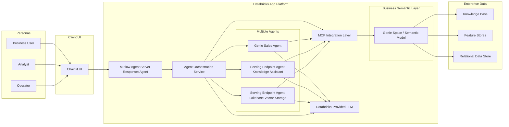
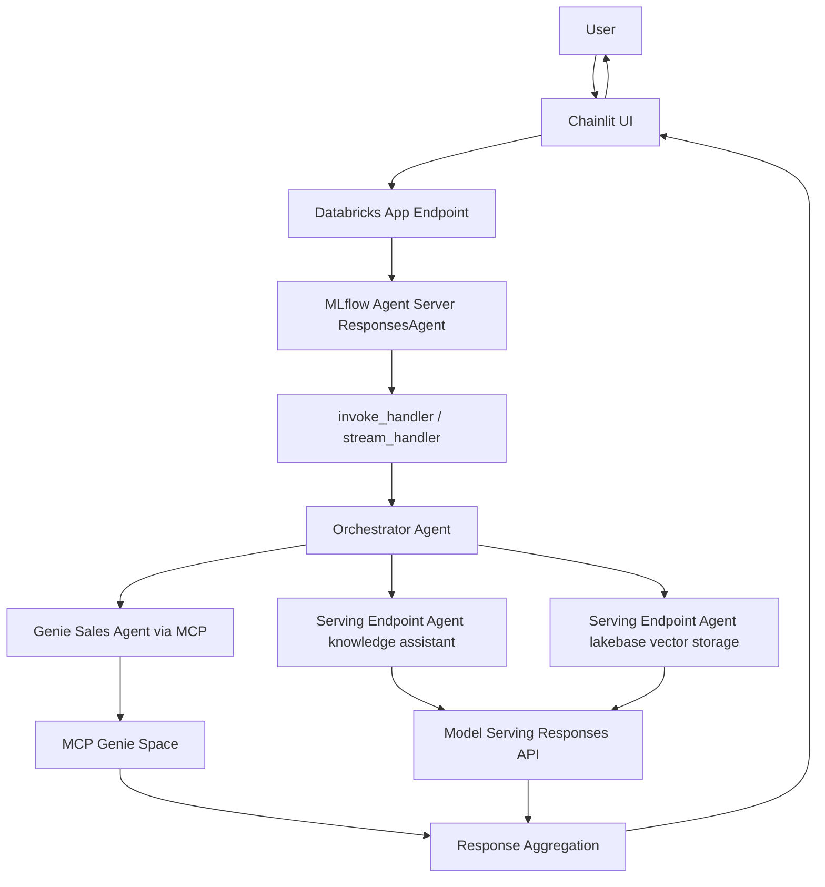

# Multiagent App on Databricks: Architecture (High Level)

## Purpose

Describe the high-level system shape, major boundaries, and end-to-end request flow.

## Scope

This document covers high-level architecture only. Implementation-level details are in `docs/design.md`, and operational procedures are in `docs/runbook.md`.

## Current Status (2026-07-01)

- Dev deployment is live with Chainlit enabled.
- Hosted runtime uses `uv run start-app`.
- Deployments may intermittently fail when Terraform provider registry is unreachable; direct app deploy is the operational fallback.

## Main Content

### Overview

This project is an MVP multi-agent orchestrator deployed on Databricks Apps.
It routes user requests to one or more backend capabilities:

- Genie space tools (via MCP)
- Serving endpoint agents
- Optional app-based specialists

Runtime stack:

- MLflow Agent Server
- OpenAI Agents SDK
- Databricks OpenAI-compatible runtime clients

### Major Components

- Client: Chainlit UI
- Entry runtime: MLflow Agent Server (`ResponsesAgent`)
- Orchestration layer: tool selection and response composition
- Integration layer: MCP + serving endpoint calls
- Data and semantic layer: Genie space, enterprise data assets

### Deployment Diagram

### Request Flow

### Environment Topology

| Environment | Target | Mode | Profile |
| ---- | ---- | ---- | ---- |
| Development | dev | development | dev |
| QA | qa | development | qa |
| Staging | stg | production | stg |
| Production | prod | production | prd |

## Related Docs

- `docs/design.md`: low-level implementation details
- `docs/runbook.md`: operations and incident handling
