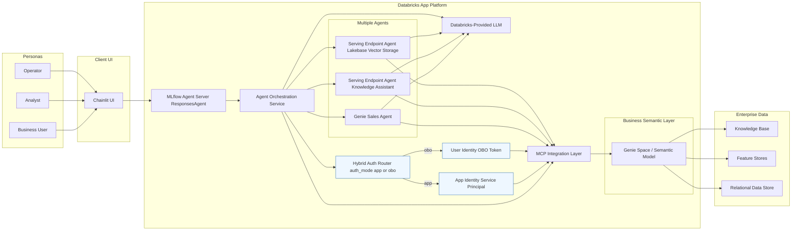
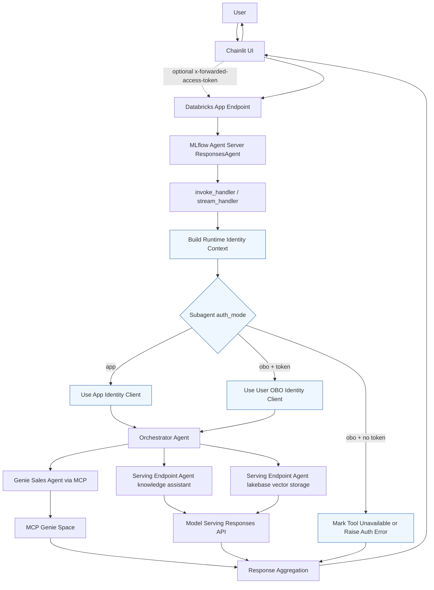

# Multiagent App on Databricks: Architecture (High Level)

## Purpose

Describe the system shape, major boundaries, and end-to-end request flow.

## Scope

This document covers high-level architecture only. Implementation-level details are in `docs/design.md`, and operational procedures are in `docs/runbook.md`.

## Current Status

- Dev deployment is live with Chainlit enabled.
- Hosted runtime uses `uv run start-app`.
- Deployments may intermittently fail when Terraform provider registry is unreachable; direct app deploy is the operational fallback.

## Main Content

### Overview

This project is an MVP multi-agent orchestrator deployed on Databricks Apps.
It routes user requests across backend capabilities:

- Genie space tools (via MCP)
- Serving endpoint agents
- Optional app-based specialists

Authorization boundary:

- App identity is used for app-auth tools.
- User identity (OBO) is used for user-auth tools when a forwarded token is present.
- OBO token propagation uses `x-forwarded-access-token` from UI to backend.

Runtime stack:

- MLflow Agent Server
- OpenAI Agents SDK
- Databricks OpenAI-compatible runtime clients
- Structured message bus events for request/tool lifecycle observability
- Governed policy and response-guardrail enforcement for sensitive routes

### Major Components

- Client: Chainlit UI
- Entry runtime: MLflow Agent Server (`ResponsesAgent`)
- Orchestration layer: tool selection and response composition
- Integration layer: MCP + serving endpoint calls
- Data and semantic layer: Genie space, enterprise data assets

### Frameworks and Platform Stack

- FastAPI: backend API framework for agent runtime endpoints.
- Uvicorn: ASGI server for backend execution.
- MLflow Agent Server (`ResponsesAgent`): invoke/stream serving runtime.
- OpenAI Agents SDK: agent orchestration and tool-calling loop.
- Databricks OpenAI integration: Responses API client integration for Databricks-hosted models and endpoints.
- Chainlit: conversational frontend UI and streaming interaction layer.
- Databricks Apps: managed application hosting platform.
- Databricks Declarative Automation Bundles (DAB): deployment framework with target-based environment management.

### Deployment Diagram

### Request Flow

### Authorization Routing

The orchestrator uses subagent-level auth configuration (`auth_mode`) to decide execution identity:

- `app`: run tool/MCP calls with app identity.
- `obo`: run tool/MCP calls with user identity derived from forwarded token.

If an `obo` tool is required but no forwarded token is available, the tool is marked unavailable or returns a clear authorization error.

### Message Bus Observability

The runtime publishes message-bus events at key orchestration points:

- Request lifecycle: invoke/stream started, succeeded, failed
- Runtime auth lifecycle: identity resolved, trace metadata updated, context built
- Policy lifecycle: subagent allow/deny decision events with reason codes
- Tool lifecycle: tool call started, succeeded, failed
- MCP lifecycle: server registered or unavailable
- Response lifecycle: guardrail pass/block decisions

Supported message bus backends:

- `structured_logging` (default)
- `noop`
- `kafka`
- `rabbitmq`
- `uc_table` for Unity Catalog-governed Delta audit persistence

### Environment Topology

| Environment | Target | Mode | Profile |
| ---- | ---- | ---- | ---- |
| Development | dev | development | dev |
| QA | qa | development | qa |
| Staging | stg | production | stg |
| Production | prod | production | prd |

## Related Docs

- `docs/design.md`: low-level implementation details
- `docs/runbook.md`: operations and incident handling
