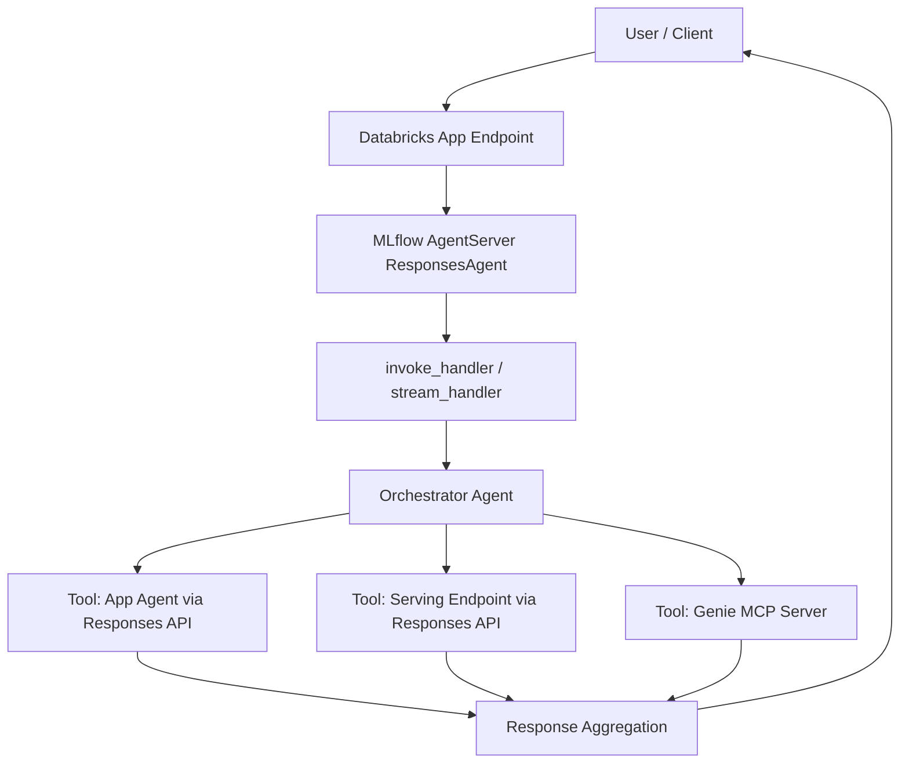

# Multiagent App on Databricks: Architecture

## Overview

This project is an MVP multi-agent orchestrator deployed on Databricks Apps.
It routes user requests to one or more backend capabilities:

- Databricks App-based specialist agents
- Databricks Genie space tools (via MCP)
- Databricks Model Serving endpoints

The runtime is built with MLflow Agent Server and OpenAI Agents SDK.

## Core Components

- `agent_server/start_server.py`: boots MLflow `AgentServer` (`ResponsesAgent`) and exposes the app.
- `agent_server/agent.py`: defines orchestrator logic, tool wiring, and invoke/stream handlers.
- `agent_server/utils.py`: helper functions for MCP URLs, session metadata, and stream event processing.
- `scripts/start_app.py`: local process manager for backend and optional frontend chat UI.
- `resources/app.yml`: shared Databricks app/resource defaults.
- `targets/*.yml`: environment-specific workspace, identity, and permission overrides.

## Request Flow

## Runtime Model

- `@invoke` handles non-streaming responses.
- `@stream` handles token/event streaming.
- MCP servers are health-checked per request and unhealthy sources are excluded.
- OpenAI/Databricks client calls are traced via MLflow autologging.

## Deployment Topology

Environment targets are configured with Databricks Declarative Automation Bundles:

- `dev`
- `qa`
- `stg`
- `prod`

Each target defines:

- `workspace.host`, `root_path`, `state_path`
- target variables for endpoint/space/app identities
- target-specific resource permission overrides

## Permissions Model

Shared defaults are defined in `resources/app.yml`.
Target-specific permission and identity differences are defined in `targets/*.yml` under target-level `resources` overrides.

Current pattern:

- Lower environments can use reduced permission levels (for example, `CAN_EDIT`).
- Higher environments can use stricter operational levels (for example, `CAN_MANAGE`).

## Local Development

- `uv run start-server`: backend only (Agent Server)
- `uv run start-app`: backend + frontend process orchestration
- `uv run start-app --no-ui`: backend only, skip frontend build/run

## Observability

- MLflow tracing for request execution and tool interactions
- local process logs: `backend.log`, `frontend.log`
- Databricks app logs in deployed environments

## MVP Boundaries

Included in MVP:

- Multi-backend orchestration and routing
- Multi-target deployment and config separation
- Basic tracing/logging and streaming support

Not fully productized in MVP:

- advanced SLO dashboards and alerting
- full enterprise security automation across all workspace policy variants
- complete CI/CD guardrail automation

## Related Docs

- `README.md`: setup, configuration, and deployment quick paths
- `docs/agent_framework.md`: development workflow and skill usage
- `docs/runbook.md`: operations, incident response, and rollback
