# Architecture Board Review Pack

This document is the single-page review pack that embeds the complete AI system design diagram set across concept, logical, and deployment phases.

## Source Artifact Set

- [README.md](README.md)
- [01-concept-high-level.md](01-concept-high-level.md)
- [02-concept-detailed.md](02-concept-detailed.md)
- [03-logical-high-level.md](03-logical-high-level.md)
- [04-logical-detailed.md](04-logical-detailed.md)
- [05-deployment-high-level.md](05-deployment-high-level.md)
- [06-deployment-detailed.md](06-deployment-detailed.md)

## Concept Phase: High Level

### Business Capability Map

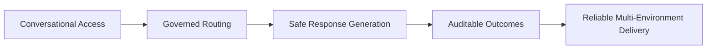

### Stakeholder and Actor Map

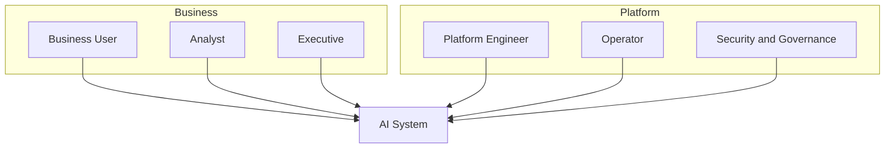

### System Context Diagram

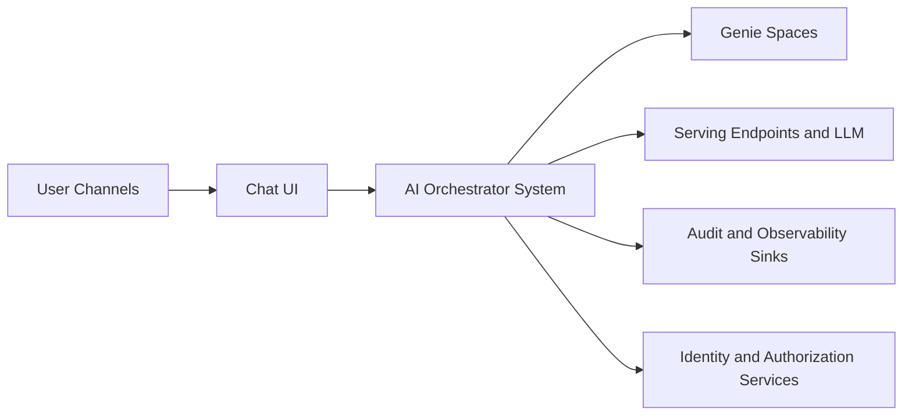

### Business Value and Decision Flow

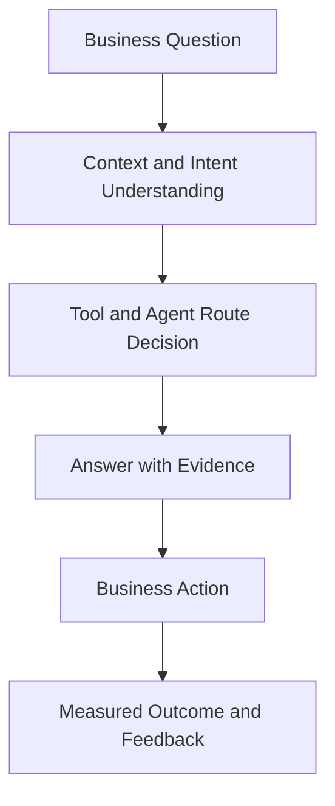

## Concept Phase: Detailed

### Product Scope Map

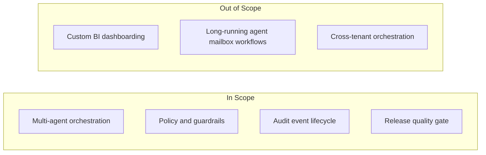

### Trust Boundary and Risk Sketch

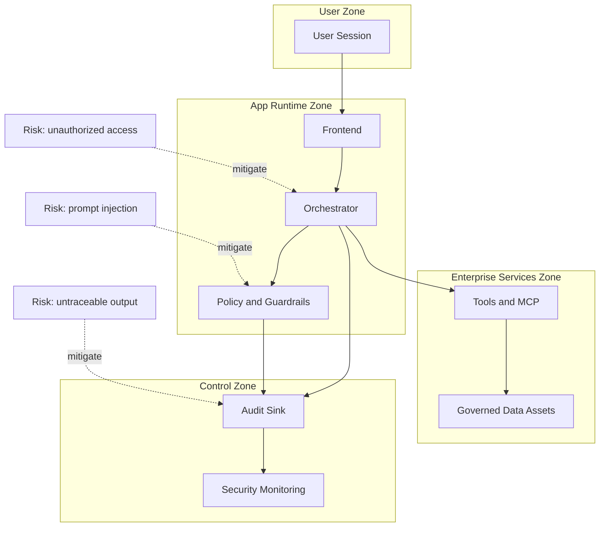

## Logical Phase: High Level

### Container Diagram

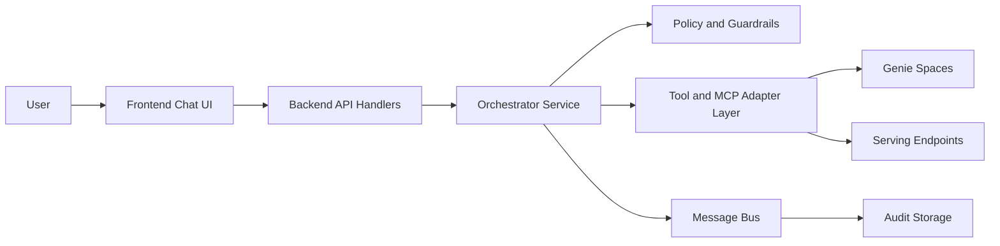

### End-to-End Request Flow

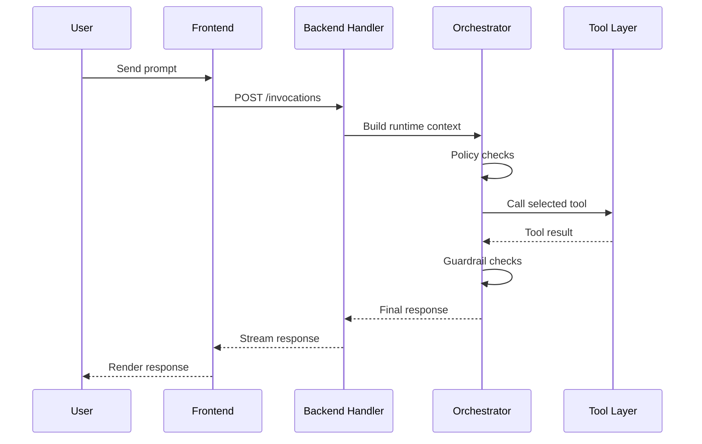

### Data Flow and Lineage

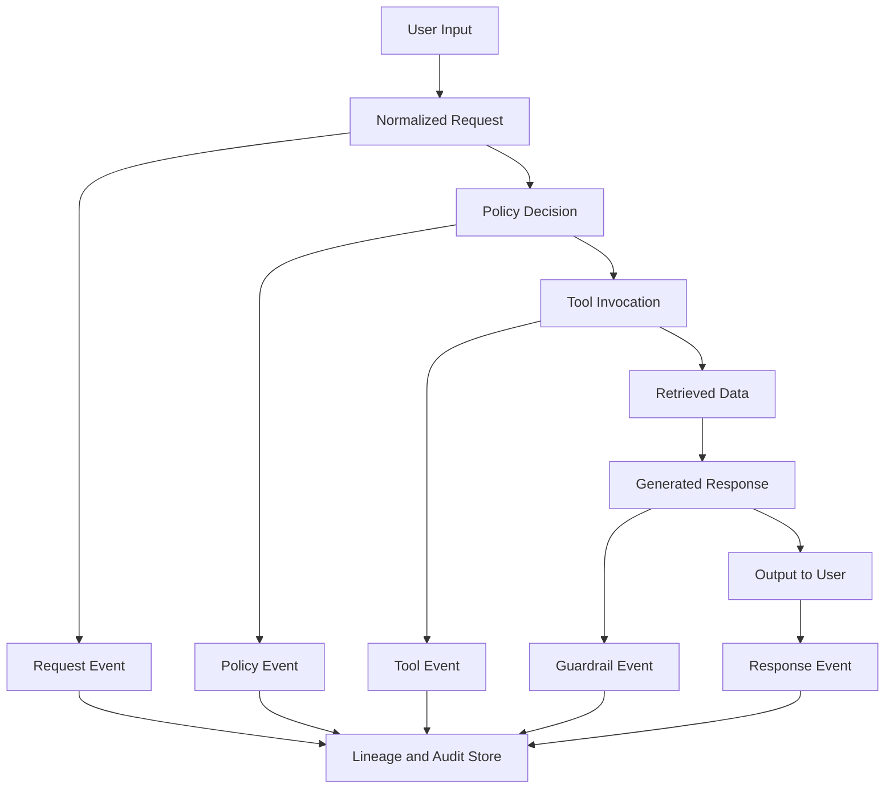

### Security and Identity Flow

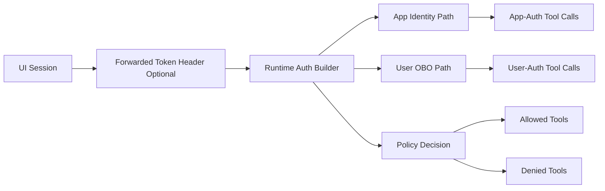

## Logical Phase: Detailed

### Component Diagram: Backend Runtime

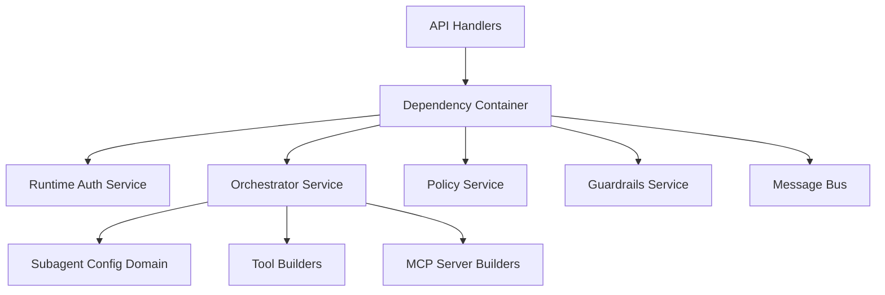

### Orchestration and Tool Call Sequence

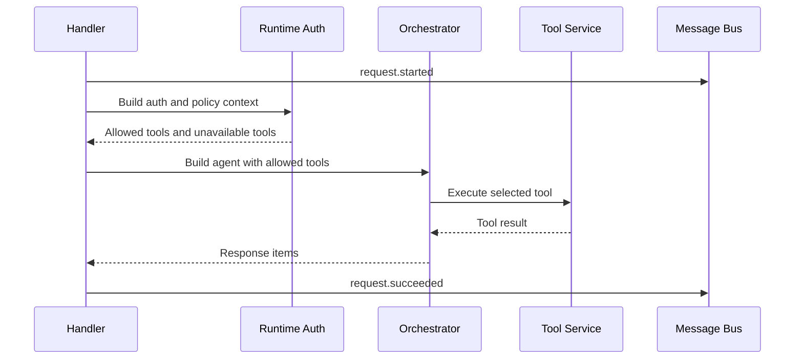

### Prompt and Policy Layering

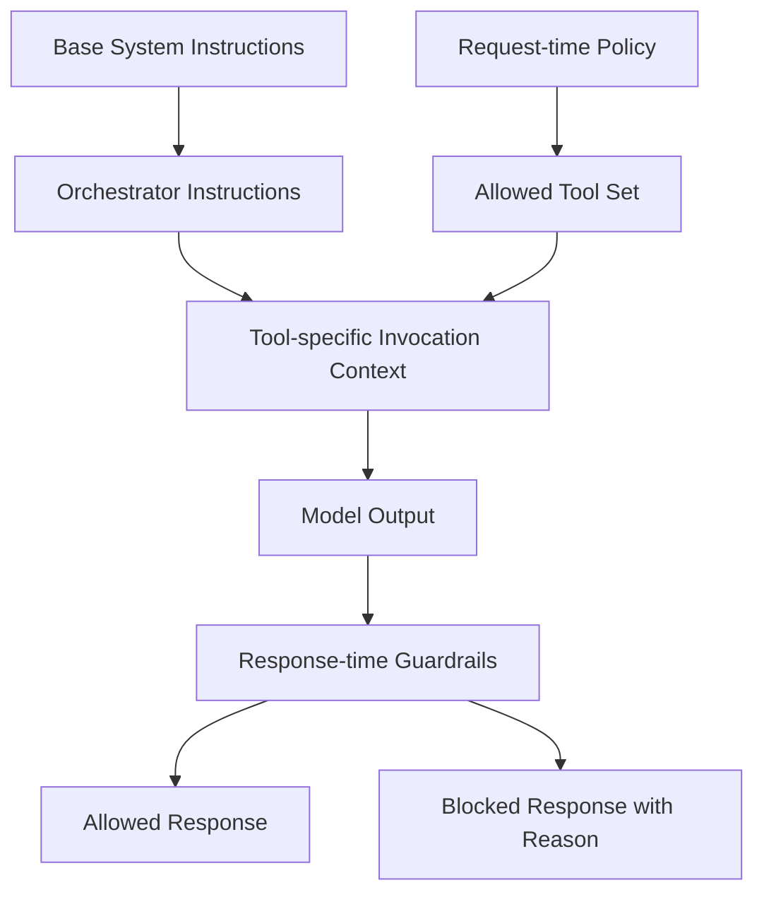

### Session and State Model

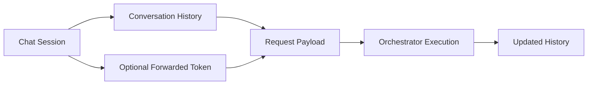

### Failure and Recovery Flow

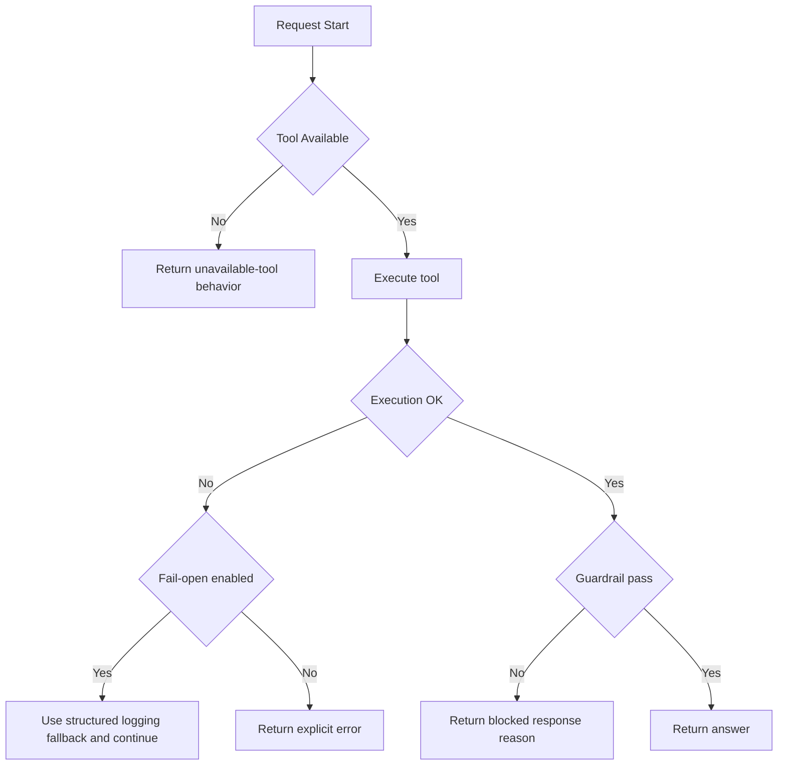

### Evaluation and Release Gate Flow

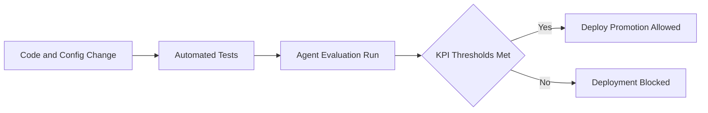

## Deployment Phase: High Level

### Environment Topology

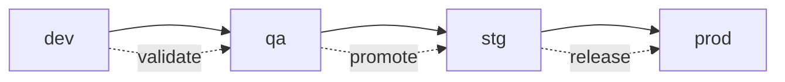

### Runtime Deployment Map

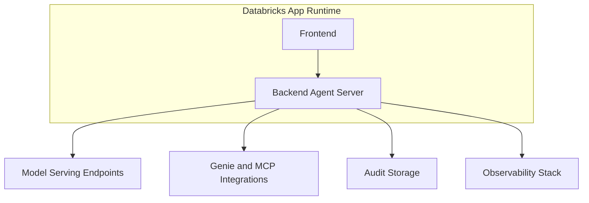

## Deployment Phase: Detailed

### Network and Security Topology

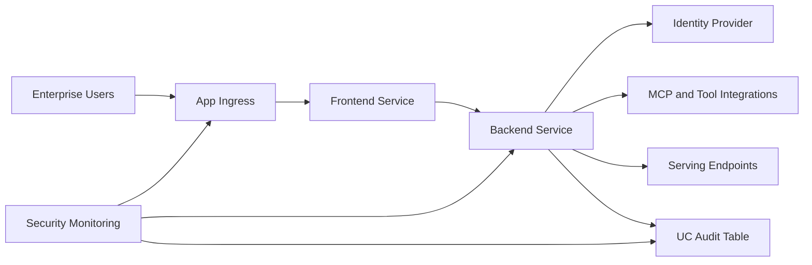

### CI/CD and Promotion Pipeline

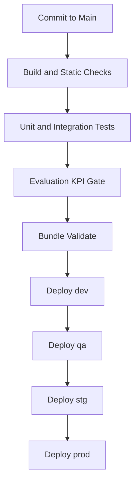

### Observability Architecture

```mermaid
flowchart TB
    Req[Request Lifecycle] --> MB[Message Bus]
    Tool[Tool Lifecycle] --> MB
    Pol[Policy and Guardrail Decisions] --> MB

    MB --> Log[Structured Logs]
    MB --> Queue[Kafka or RabbitMQ]
    MB --> UCTable[UC Audit Table]

    Log --> Dash[Dashboards and Alerts]
    Queue --> Dash
    UCTable --> Dash
```

### HA and DR Topology

```mermaid
flowchart LR
    subgraph Primary[Primary Region]
        A1[App Runtime]
        A2[Model Integrations]
        A3[Audit Storage]
    end

    subgraph Recovery[Recovery Region]
        B1[Standby Runtime]
        B2[Standby Integrations]
        B3[Replicated Audit Storage]
    end

    A1 -. failover .-> B1
    A2 -. failover .-> B2
    A3 -. replicate .-> B3
```
