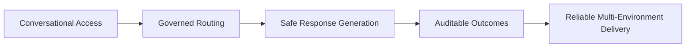
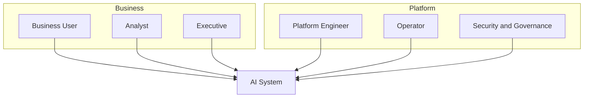
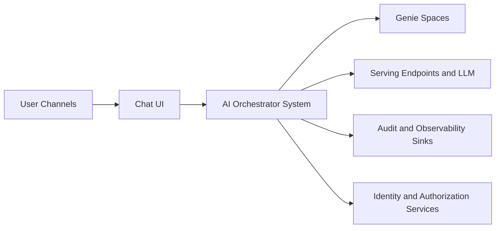
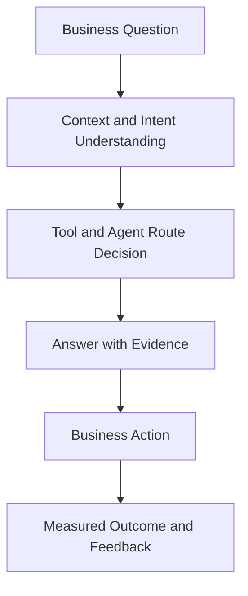

# Concept Phase: High-Level Diagrams

This document captures high-level concept diagrams used to align stakeholders before implementation detail.

## 1. Business Capability Map

## 2. Stakeholder and Actor Map

## 3. System Context Diagram

## 4. Business Value and Decision Flow

