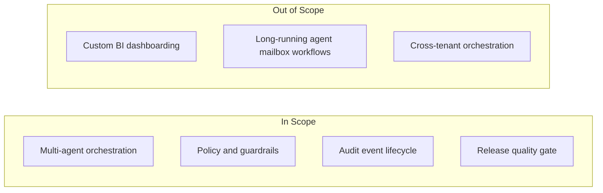
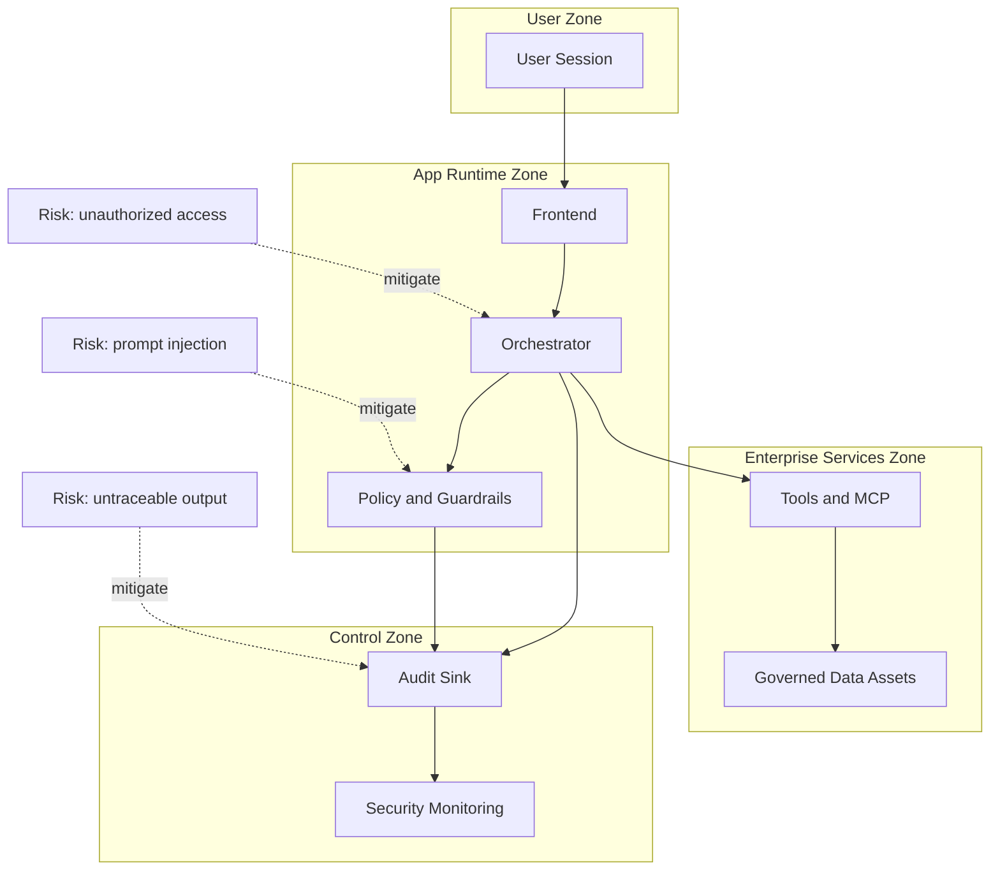

# Concept Phase: Detailed Diagrams

This document captures detailed concept artifacts that shape implementation boundaries and governance assumptions.

## 1. Product Scope Map

## 2. Trust Boundary and Risk Sketch

