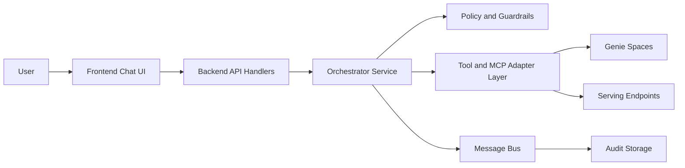
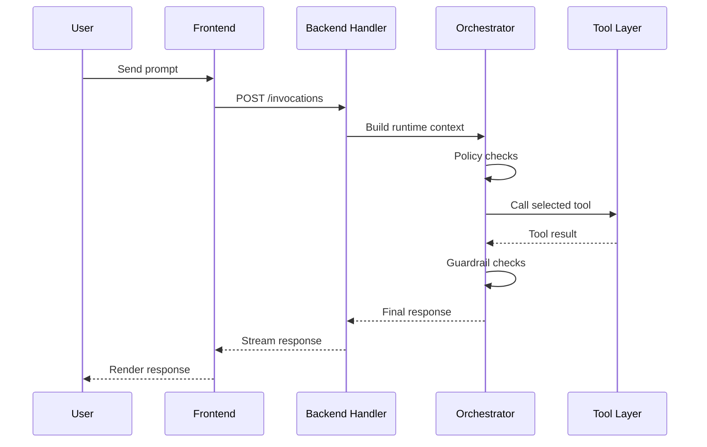
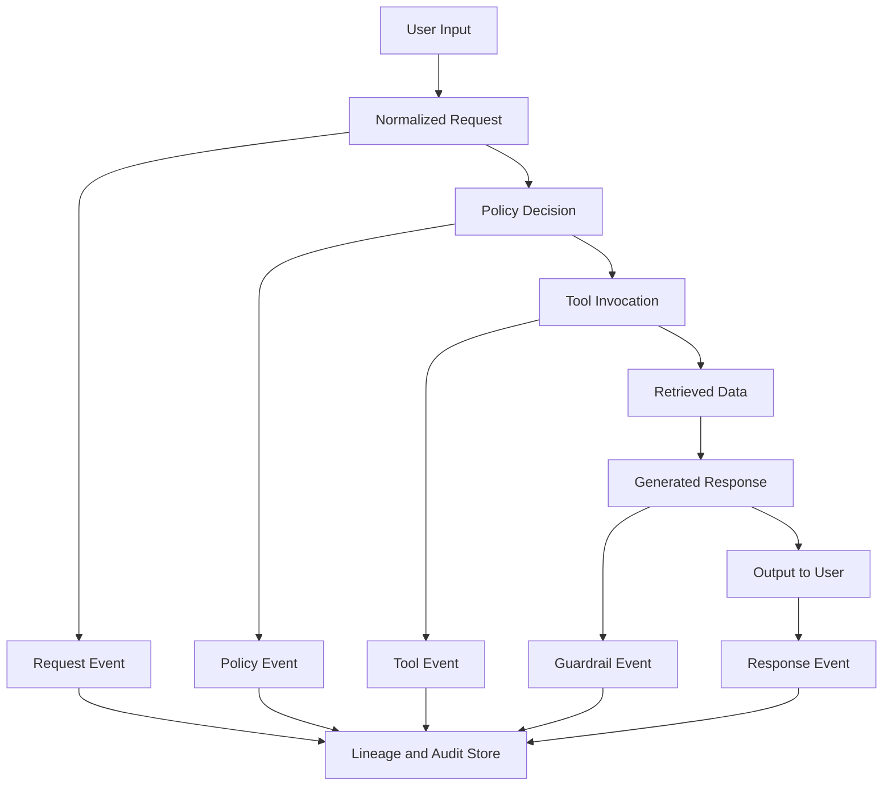
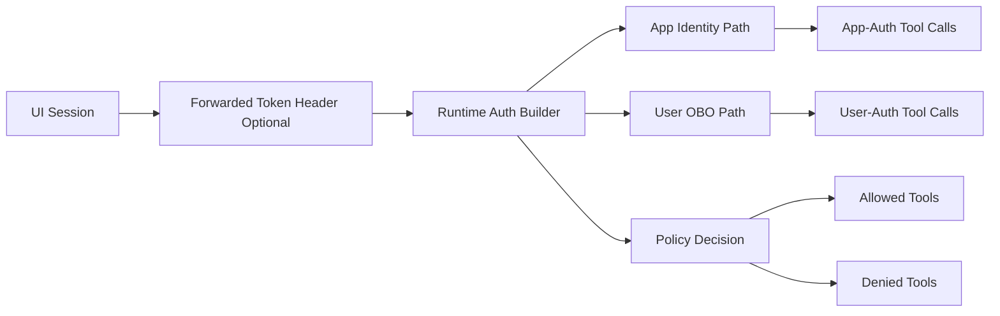

# Logical Phase: High-Level Diagrams

This document captures high-level logical architecture and end-to-end runtime flows.

## 1. Container Diagram

## 2. End-to-End Request Flow

## 3. Data Flow and Lineage

## 4. Security and Identity Flow

