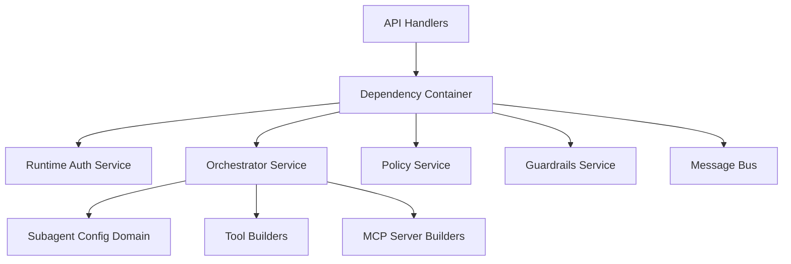
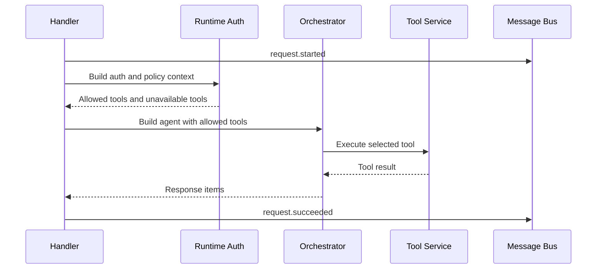
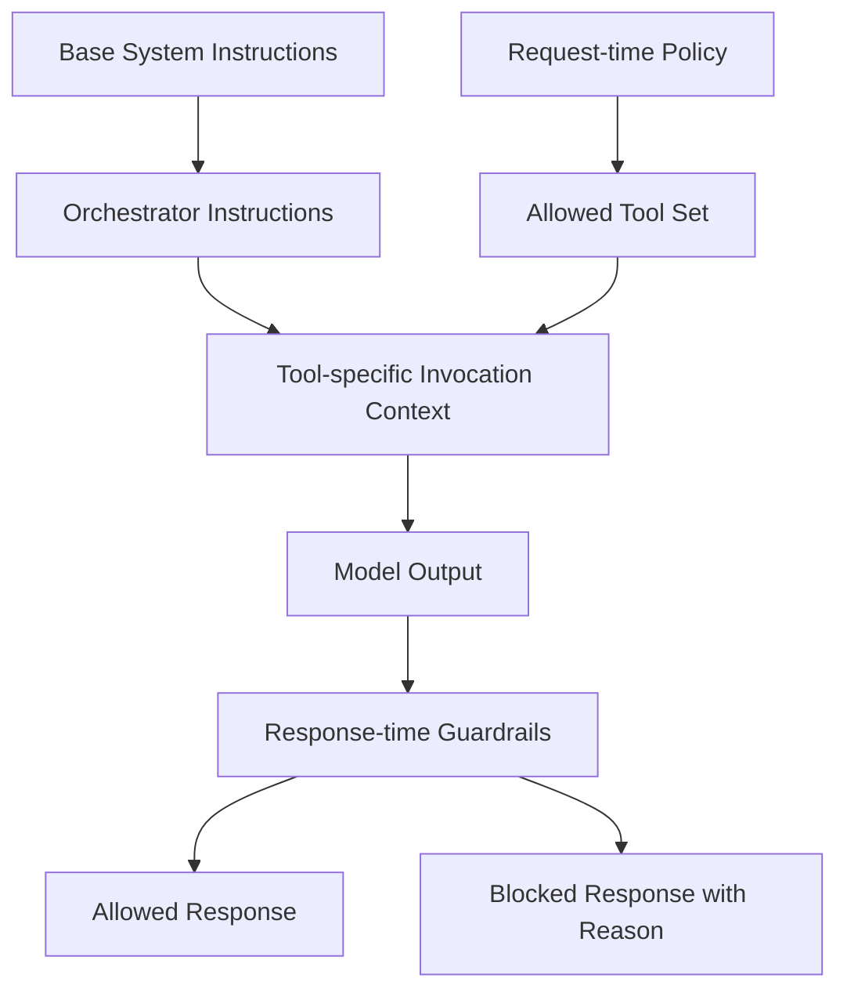
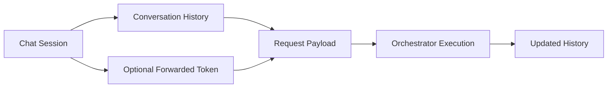
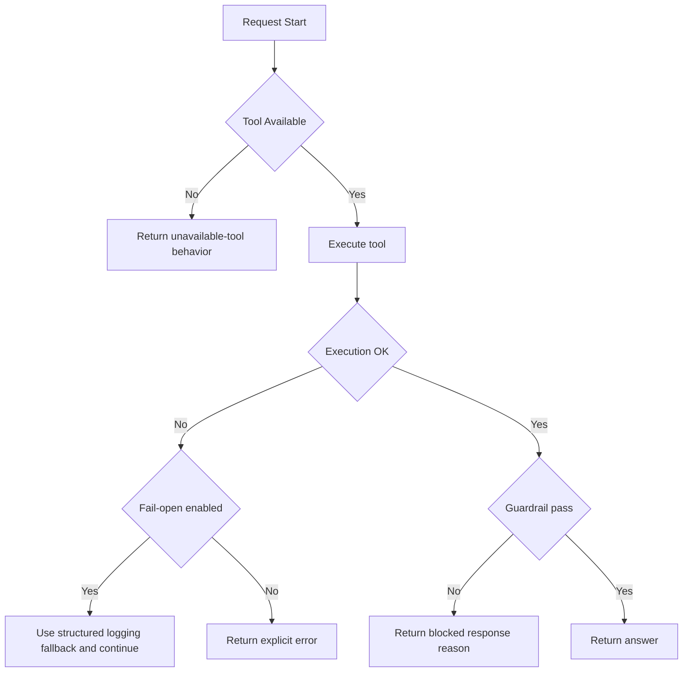
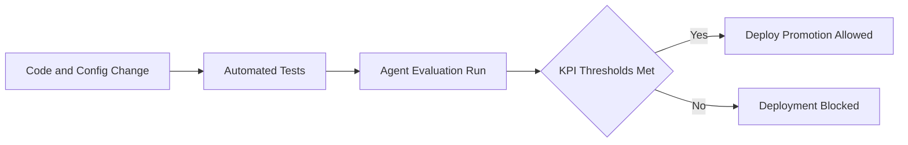

# Logical Phase: Detailed Diagrams

This document captures detailed logical artifacts for engineering implementation and review.

## 1. Component Diagram: Backend Runtime

## 2. Orchestration and Tool Call Sequence

## 3. Prompt and Policy Layering

## 4. Session and State Model

## 5. Failure and Recovery Flow

## 6. Evaluation and Release Gate Flow

