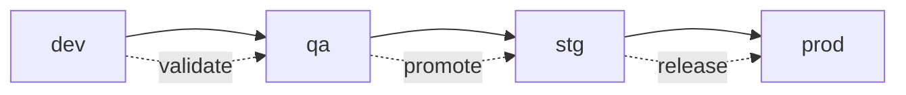
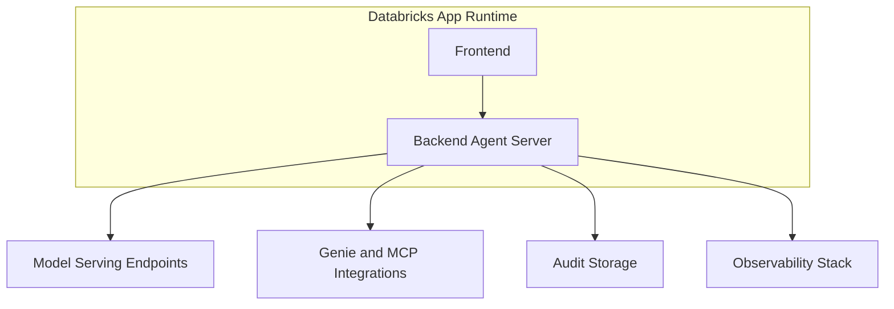

# Deployment Phase: High-Level Diagrams

This document captures high-level deployment architecture across environments.

## 1. Environment Topology

```mermaid
flowchart LR
    Dev[dev] --> QA[qa]
    QA --> STG[stg]
    STG --> PRD[prod]

    Dev -. validate .-> QA
    QA -. promote .-> STG
    STG -. release .-> PRD
```

## 2. Runtime Deployment Map

```mermaid
flowchart TB
    subgraph DatabricksApp[Databricks App Runtime]
        FE[Frontend]
        BE[Backend Agent Server]
    end

    FE --> BE
    BE --> MOD[Model Serving Endpoints]
    BE --> GEN[Genie and MCP Integrations]
    BE --> AUD[Audit Storage]
    BE --> OBS[Observability Stack]
```
