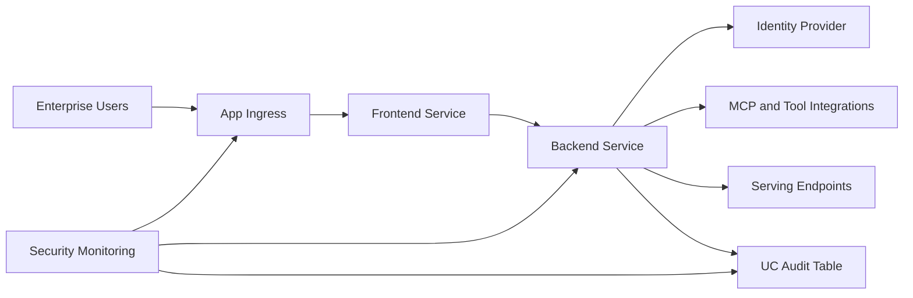
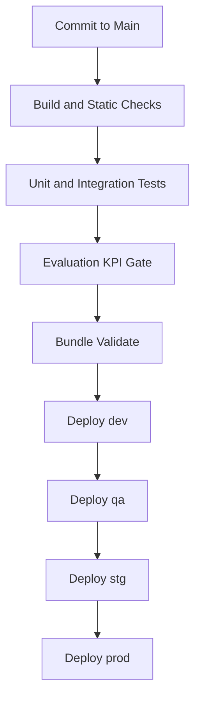
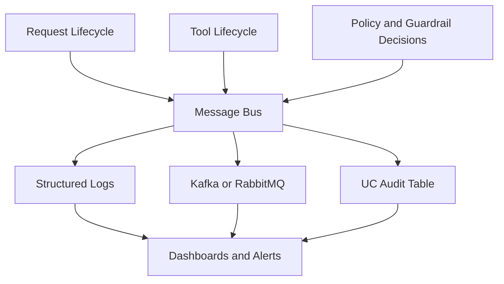
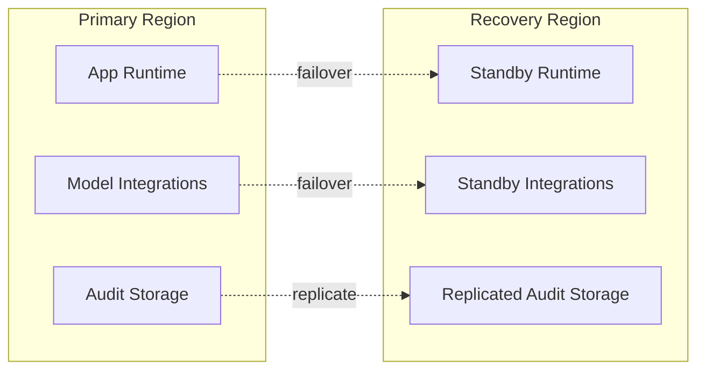

# Deployment Phase: Detailed Diagrams

This document captures detailed deployment and operations diagrams.

## 1. Network and Security Topology

## 2. CI/CD and Promotion Pipeline

## 3. Observability Architecture

## 4. HA and DR Topology

