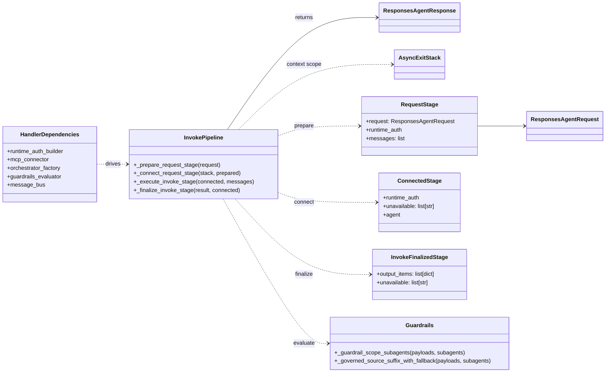
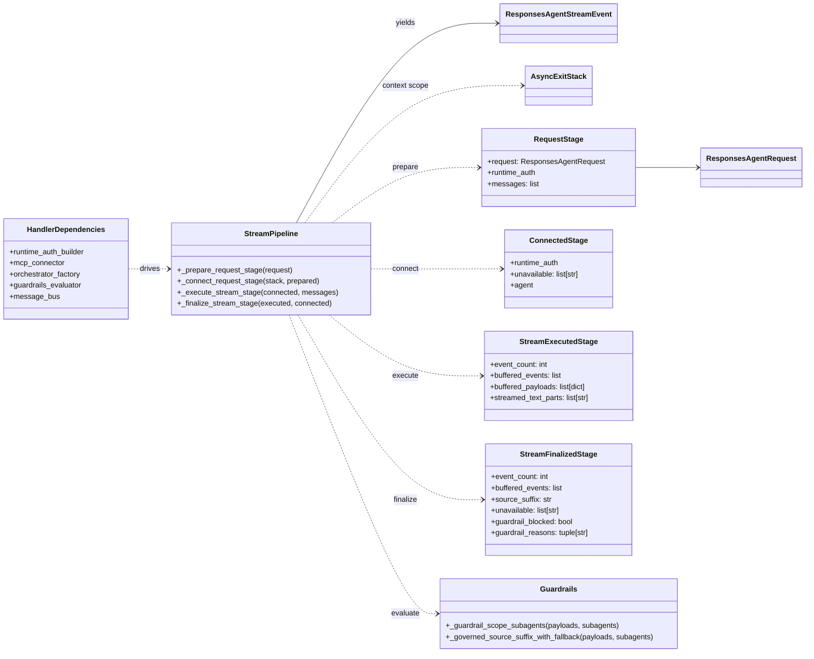

# Request Execution Flow: Class Diagram (Simplified)

These diagrams focus on request execution in `src/backend/api/handlers.py` after the staged-pipeline refactor.
They separate the invoke and stream pipeline views while preserving the shared contract context.

## Invoke Pipeline

## Stream Pipeline

## Notes

- Shared stages (`prepare`, `connect`) enforce a common pipeline contract for invoke and stream.
- Stream path buffers events, applies guardrails, then emits buffered events (plus optional source suffix event).
- Guardrail block behavior diverges by mode:
  - invoke: raises `UserError`
  - stream: emits block delta and terminates stream
