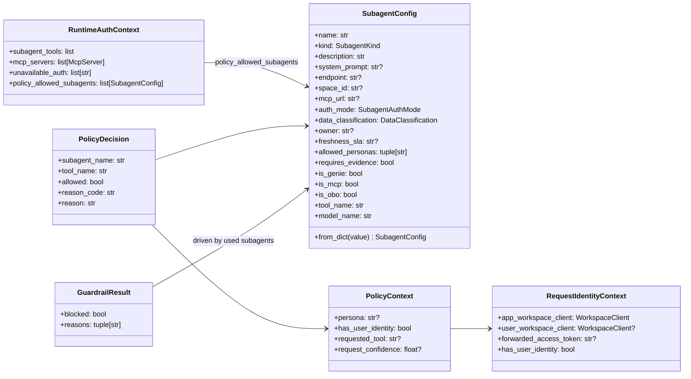
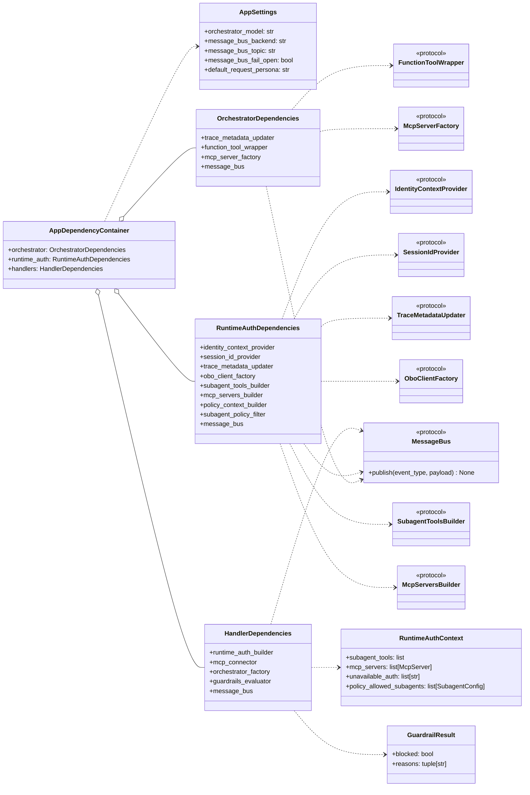
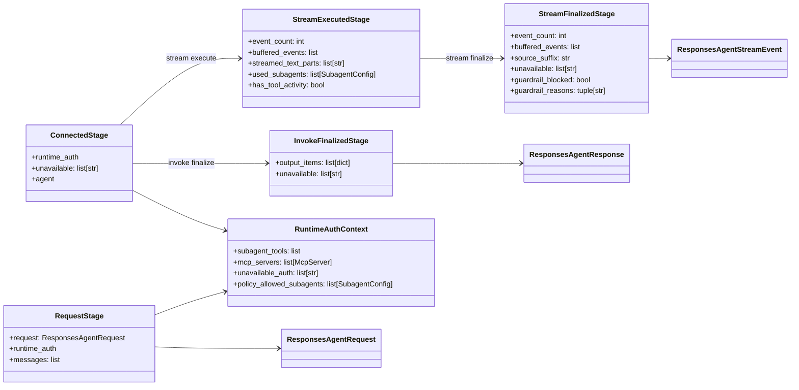
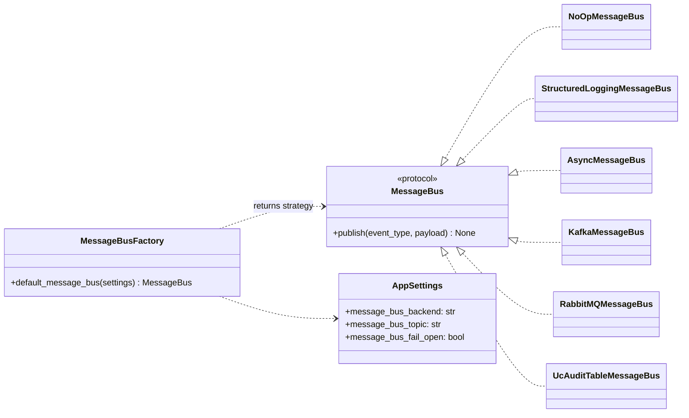

# Backend Class Diagrams

This class diagrams with several logic-isolated views.
Each view reflects current implementation naming and relationships in the backend.

## 1. Domain and Policy Model

## 2. Dependency Composition and Ports

## 3. Handler Runtime Pipeline Stages

## 4. Message Bus Strategy and Implementations

## Notes

- These are as-is structural views and mirror current implementation naming.
- The logic-relative: domain/policy, composition/ports, runtime stages, and message bus strategy.
- Use this artifact with `07-request-execution-flow-class-diagram.md` for invoke-vs-stream execution emphasis.
