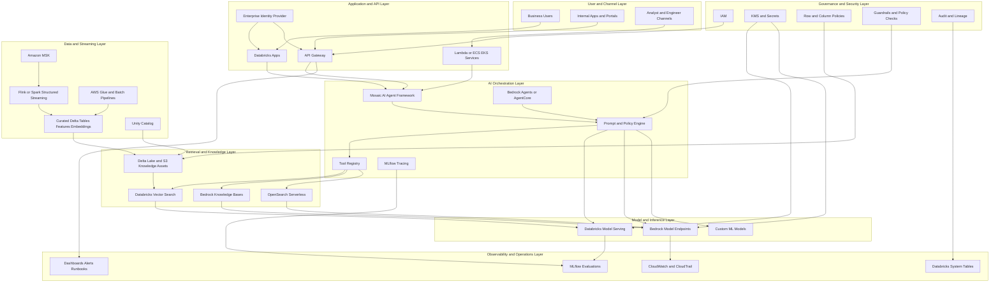

# Reference AI Architecture Pack

## 1. Architecture Decision Records (AR-001 to AR-004)

### ADR-AR-001: Explicit Layered Architecture
- Status: Approved
- Requirement Mapping: AR-001
- Context: The platform must separate user channels, APIs, orchestration, retrieval, data processing, model inference, governance, and operations with clear ownership boundaries.
- Decision: Implement an eight-layer architecture:
  1. User and Channel
  2. Application and API
  3. AI Orchestration
  4. Retrieval and Knowledge
  5. Data and Streaming
  6. Model and Inference
  7. Governance and Security
  8. Observability and Operations
- Consequences:
  - Positive: Better control ownership, auditability, and independent scaling.
  - Tradeoff: Additional integration contracts and platform coordination effort.
- Verification Evidence:
  - Approved architecture diagram
  - Layer ownership matrix
  - Service boundary review signoff

### ADR-AR-002: Contract-First Hybrid Integration
- Status: Approved
- Requirement Mapping: AR-002
- Context: Databricks and AWS services must interoperate with identity providers, model endpoints, vector indexes, and monitoring systems.
- Decision: Define and enforce contract-first integration using versioned interfaces for:
  - AuthN and AuthZ (identity provider, service entitlement)
  - Data access (catalog objects, data contracts, retention constraints)
  - Retrieval interfaces (vector and metadata filters)
  - Model invocation (request and response schemas, fallback behavior)
  - Observability (trace IDs, metric dimensions, audit event format)
- Consequences:
  - Positive: Reduced coupling and safer service evolution.
  - Tradeoff: Governance overhead for schema/version lifecycle.
- Verification Evidence:
  - Interface catalog with owners
  - Dependency map
  - Contract compatibility test results

### ADR-AR-003: Workload-Class Architecture
- Status: Approved
- Requirement Mapping: AR-003
- Context: The platform must support batch, streaming, interactive, and asynchronous AI workloads with distinct non-functional constraints.
- Decision:
  - Interactive flows: low-latency API and model routes with strict timeout and fallback controls.
  - Asynchronous flows: workflow queues, retries, and idempotent execution semantics.
  - Streaming flows: MSK plus Flink or Spark Structured Streaming for incremental updates.
  - Batch flows: scheduled pipelines for backfills, large-scale recomputation, and model refresh.
- Consequences:
  - Positive: Better reliability and cost control per workload type.
  - Tradeoff: More complex operational runbooks and SLO matrix.
- Verification Evidence:
  - Workload classification catalog
  - Performance and resiliency test reports
  - SLO conformance dashboard

### ADR-AR-004: Databricks-First with AWS-Native Extensions
- Status: Approved
- Requirement Mapping: AR-004
- Context: Enterprise workloads require governed lakehouse operations and selective cloud-native AI service integration.
- Decision: Adopt Databricks-first control and data foundation with AWS-native augmentation:
  - Databricks: Delta Lake, Unity Catalog, Mosaic AI, Model Serving, Vector Search, MLflow, Databricks Apps
  - AWS: Bedrock, API Gateway, Lambda, OpenSearch Serverless, IAM, CloudWatch, CloudTrail, KMS
- Consequences:
  - Positive: Strong governance plus cloud-native flexibility.
  - Tradeoff: Cross-platform policy and telemetry harmonization is mandatory.
- Verification Evidence:
  - Platform mapping approval
  - Architecture decision review signoff
  - Security control harmonization report

## 2. Deployment Topology by Environment

### 2.1 Environment Intent
- dev: fast iteration, synthetic and masked test data, lower guardrails for development productivity.
- qa: integration and regression validation, contract verification, replay and deterministic test gates.
- stg: pre-production realism for scale, resiliency, and release candidate validation.
- prod: strict governance, mandatory approvals, high availability, and full audit enforcement.

### 2.2 Logical Topology

| Environment | Databricks Workspace | Data Isolation | Model Serving | Retrieval Indexes | API Surface | Monitoring | Change Control |
|---|---|---|---|---|---|---|---|
| dev | Dedicated dev workspace | Non-production catalogs and schemas | Experimental and canary endpoints | Dev vector indexes only | Internal dev APIs | Basic dashboards and logs | Lightweight approvals |
| qa | Dedicated qa workspace | QA snapshots and masked production-like data | Version-locked test endpoints | QA indexes rebuilt per cycle | QA service endpoints | Full test telemetry | Formal test signoff |
| stg | Dedicated stg workspace | Near-production data contracts | Release-candidate endpoints | Staging indexes with production scale shape | Staging APIs with controlled access | SLO and incident simulations | Release board approval |
| prod | Dedicated prod workspace | Production catalogs with policy controls | Highly available production endpoints | Production indexes with backup and recovery strategy | Production APIs and apps | Full operational telemetry and alerting | CAB and owner approvals |

### 2.3 Promotion Path
1. dev to qa after unit, integration, and contract tests pass.
2. qa to stg after quality and security gates pass.
3. stg to prod after performance, resiliency, and rollback verification.
4. prod rollout with canary strategy, observability watch, and rollback readiness.

### 2.4 Required Gates per Promotion
- Data gate: approved data contracts, lineage evidence, quality checks.
- Model gate: evaluation report, threshold pass, drift readiness.
- Security gate: access review, secrets validation, policy enforcement tests.
- Ops gate: dashboards, alerts, runbook readiness, escalation path test.
- Cost gate: budget impact review and cost-per-request acceptance.

## 3. Requirement Traceability Matrix Template

Use this template to map all requirements and release evidence.

| Requirement ID | Domain | Requirement Summary | Architecture Layer | Services or Components | Owner | Design Decision or ADR | Verification Method | Evidence Artifact | Release Gate | Status |
|---|---|---|---|---|---|---|---|---|---|---|
| BR-001 | Business | Prioritize measurable value use cases | Governance and Operations | Value scorecard process | Business Product Owner | ADR-AR-001 | Portfolio review | Approved use-case charter | Business readiness | Planned |
| BR-002 | Business | Baseline KPI and uplift plan required | Observability and Operations | KPI measurement dashboard | Business Product Owner | ADR-AR-003 | KPI plan review | Baseline and target dashboard | Business readiness | Planned |
| BR-003 | Business | Escalation and human review for sensitive outcomes | Application and AI Orchestration | Escalation workflow, policy engine | Business Product Owner | ADR-AR-002 | Workflow test | Escalation test evidence | Safety gate | Planned |
| AR-001 | Architecture | Explicit layered design | All layers | Architecture blueprint | Enterprise Architect | ADR-AR-001 | Architecture review | Approved architecture diagram | Architecture gate | Planned |
| AR-002 | Architecture | Versioned integration contracts | Application, Orchestration, Retrieval | API specs, event schemas | Technical Owner | ADR-AR-002 | Contract test | Interface catalog | Integration gate | Planned |
| AR-003 | Architecture | Support four workload classes | Data, Orchestration, Operations | Streaming plus batch plus async patterns | Enterprise Architect | ADR-AR-003 | Non-functional testing | Performance report | NFR gate | Planned |
| AR-004 | Architecture | Databricks-first plus AWS integration | Platform foundation | Databricks and AWS mapping | Enterprise Architect | ADR-AR-004 | Design review | Platform mapping approval | Platform gate | Planned |
| FR-001 | Functional | Governed model invocation and fallback | Model and Inference | Model registry and routing | Model Owner | ADR-AR-004 | Functional and policy tests | Model invocation evidence | Model gate | Planned |
| DR-001 | Data and Retrieval | Governed retrieval with source traceability | Retrieval and Knowledge | Vector search and metadata filters | Data Owner | ADR-AR-002 | Retrieval relevance and access tests | Retrieval evaluation report | Data gate | Planned |
| SR-001 | Security | Least privilege and encrypted operations | Governance and Security | IAM, KMS, secrets, masks | Security Owner | ADR-AR-004 | Security testing | Threat model and control report | Security gate | Planned |
| OR-001 | Operations | SLO, alerting, and incident readiness | Observability and Operations | MLflow, CloudWatch, runbooks | Operations Owner | ADR-AR-003 | Operational readiness review | SLO and runbook evidence | Ops gate | Planned |
| CR-001 | Cost | Cost-per-request and budget control | Observability and Operations | FinOps dashboards and budgets | Operations Owner | ADR-AR-003 | Cost review | Budget and utilization report | Cost gate | Planned |
| AC-001 | Acceptance | No production promotion without evidence package | Cross-cutting | Governance workflow | Enterprise Architect | ADR-AR-001 | Release audit | Signed release checklist | Final release gate | Planned |

## 4. Minimum Evidence Package for Production Release
- Architecture decision and design review approval
- Data contract and lineage evidence
- Model evaluation and threshold pass report
- Security validation and exception register
- SLO dashboard, alert inventory, and runbook
- Cost impact review and budget approval
- Rollback and support handoff confirmation

## 5. Mermaid Reference Diagram

## 6. Usage Notes
- Keep each requirement row linked to an owner and a concrete evidence artifact.
- Do not promote to production if any required gate is not satisfied.
- Treat this document as the baseline architecture control record for AI releases.
