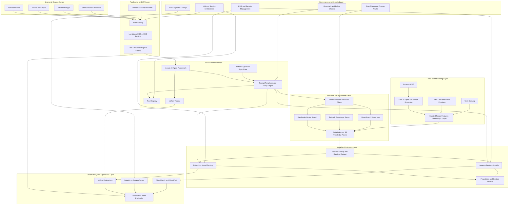

# AI Systems Architecture Diagram

```mermaid
flowchart TB
  %% Channels
  subgraph L1[User and Channel Layer]
    U1[Business Users]
    U2[Internal Web Apps]
    U3[Databricks Apps]
    U4[Service Portals and APIs]
  end

  %% App/API
  subgraph L2[Application and API Layer]
    A1[Enterprise Identity Provider]
    A2[API Gateway]
    A3[Lambda or ECS or EKS Services]
    A4[Rate Limit and Request Logging]
  end

  %% Orchestration
  subgraph L3[AI Orchestration Layer]
    O1[Mosaic AI Agent Framework]
    O2[Bedrock Agents or AgentCore]
    O3[Prompt Templates and Policy Engine]
    O4[Tool Registry]
    O5[MLflow Tracing]
  end

  %% Retrieval
  subgraph L4[Retrieval and Knowledge Layer]
    R1[Databricks Vector Search]
    R2[Bedrock Knowledge Bases]
    R3[OpenSearch Serverless]
    R4[Delta Lake and S3 Knowledge Assets]
    R5[Permission and Metadata Filters]
  end

  %% Data/streaming
  subgraph L5[Data and Streaming Layer]
    D1[Amazon MSK]
    D2[Flink or Spark Structured Streaming]
    D3[AWS Glue and Batch Pipelines]
    D4[Curated Tables Features Embeddings Graph]
    D5[Unity Catalog]
  end

  %% Model serving
  subgraph L6[Model and Inference Layer]
    M1[Databricks Model Serving]
    M2[Foundation and Custom Models]
    M3[Amazon Bedrock Models]
    M4[Feature Lookup and Runtime Context]
  end

  %% Governance/security
  subgraph L7[Governance and Security Layer]
    G1[IAM and Service Entitlements]
    G2[KMS and Secrets Management]
    G3[Row Filters and Column Masks]
    G4[Guardrails and Policy Checks]
    G5[Audit Logs and Lineage]
  end

  %% Operations
  subgraph L8[Observability and Operations Layer]
    P1[MLflow Evaluations]
    P2[Databricks System Tables]
    P3[CloudWatch and CloudTrail]
    P4[Dashboards Alerts Runbooks]
  end

  %% User entry
  U1 --> A2
  U2 --> A2
  U3 --> A2
  U4 --> A2

  %% App and auth
  A1 --> A2
  A2 --> A3 --> A4 --> O1

  %% Orchestration routing
  O1 --> O3
  O2 --> O3
  O3 --> O4
  O3 --> R5

  %% Retrieval grounding
  R5 --> R1
  R5 --> R2
  R5 --> R3
  R1 --> R4
  R2 --> R4
  R3 --> R4

  %% Model execution
  O3 --> M1
  O3 --> M3
  R4 --> M4
  M4 --> M1
  M4 --> M3
  M1 --> M2
  M3 --> M2

  %% Data pipelines
  D1 --> D2 --> D4
  D3 --> D4
  D5 --> D4
  D4 --> R4

  %% Governance controls
  G1 --> A2
  G1 --> O4
  G2 --> M1
  G2 --> M3
  G3 --> R5
  G4 --> O3
  G5 --> P2

  %% Observability
  O5 --> P1
  O1 --> O5
  M1 --> P1
  M3 --> P3
  A4 --> P4
  P1 --> P4
  P2 --> P4
  P3 --> P4
```
