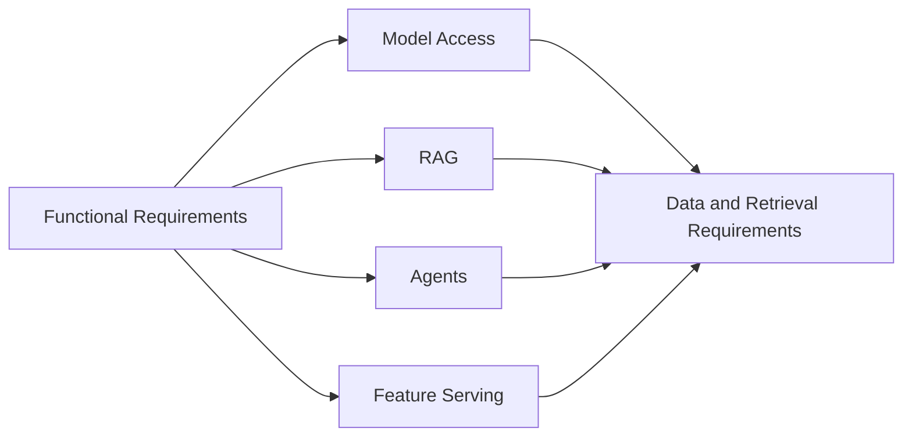

# Functional and Data Requirements

# 5. Functional Requirements

| Requirement Area | Requirement | Preferred Platform Capability |
|----|----|----|
| Model Access | The system must support multiple foundation models, custom models, and model fallback strategies for latency, quality, and cost optimization. | Databricks Model Serving, Foundation Models, Amazon Bedrock model catalog |
| RAG | The system must retrieve grounded context from governed enterprise data and return traceable, source-aware responses. | Databricks Vector Search, Bedrock Knowledge Bases, OpenSearch Serverless |
| Agents | The system must support constrained tool-calling agents with explicit permissions, bounded execution loops, and human approval for sensitive actions. | Mosaic AI Agent Framework, MLflow tracing, Bedrock Agents or AgentCore, Lambda action groups |
| Feature Serving | The system must serve offline and online features consistently to reduce training-serving skew. | Databricks Feature Store, Online Feature Store, Lakebase, model serving feature lookup |
| Applications | The system must provide authenticated user-facing AI applications and service APIs for internal enterprise users. | Databricks Apps, API Gateway, Lambda, ECS, EKS |

## 5.1 Functional Requirement Register

| ID | Requirement Statement | Priority | Verification Method |
|----|----|----|----|
| FR-001 | The system shall support governed model invocation across approved foundation models, custom models, and fallback routes. | Mandatory | Architecture review, endpoint test, access-control validation |
| FR-002 | The system shall support retrieval-augmented generation using governed enterprise knowledge sources and permission-aware retrieval. | Mandatory | RAG evaluation, source traceability test, authorization test |
| FR-003 | The system shall support constrained agent workflows with approved tool contracts, execution limits, and audit traces. | Mandatory | Agent workflow test, tool allowlist review, trace inspection |
| FR-004 | The system shall provide authenticated application and API access for authorized enterprise users and services. | Mandatory | Identity test, entitlement test, penetration review where required |
| FR-005 | The system should support reusable AI components including prompts, chains, agents, feature lookups, model endpoints, and evaluation datasets. | Recommended | Repository review, artifact registry review, deployment inspection |

# 6. Data, Retrieval, and Knowledge Requirements

- All structured data, documents, embeddings, feature tables, vector
  indexes, prompts, functions, and models must be registered or governed
  through a central catalog wherever supported.

- RAG ingestion must support document parsing, chunking, metadata
  extraction, embedding generation, incremental refresh, re-ranking, and
  quality validation before publishing to production indexes.

- Vector indexes must support low-latency semantic retrieval, metadata
  filtering, access-aware retrieval, and index refresh workflows aligned
  to source data change frequency.

- Knowledge retrieval must include evaluation datasets covering
  precision, recall, answer groundedness, citation correctness, latency,
  and failure behavior.

- Streaming events must support near-real-time updates to operational
  features, graph relationships, and vector records where business use
  cases require freshness.

## 6.1 Data and Retrieval Requirement Register

| ID | Requirement Statement | Control Owner | Acceptance Evidence |
|----|----|----|----|
| DR-001 | All production AI data sources shall have approved data contracts, catalog registration, classification, lineage, quality rules, and access-control mappings. | Data Owner | Catalog evidence, data contract, lineage view, and quality report. |
| DR-002 | RAG indexes shall support permission-aware retrieval, metadata filtering, source traceability, index freshness monitoring, and retrieval quality evaluation. | Data Owner | Retrieval test results, authorization test, freshness dashboard, and evaluation report. |
| DR-003 | Embedding pipelines shall define source scope, chunking rules, embedding model, refresh cadence, failure handling, and rollback process. | Technical Owner | Pipeline design, run history, error handling test, and rollback evidence. |
| DR-004 | Streaming updates to features, vectors, or operational state shall define freshness SLOs, lag thresholds, checkpoint strategy, replay strategy, and data quality controls. | Operations Owner | SLO report, lag dashboard, checkpoint validation, and replay test. |

