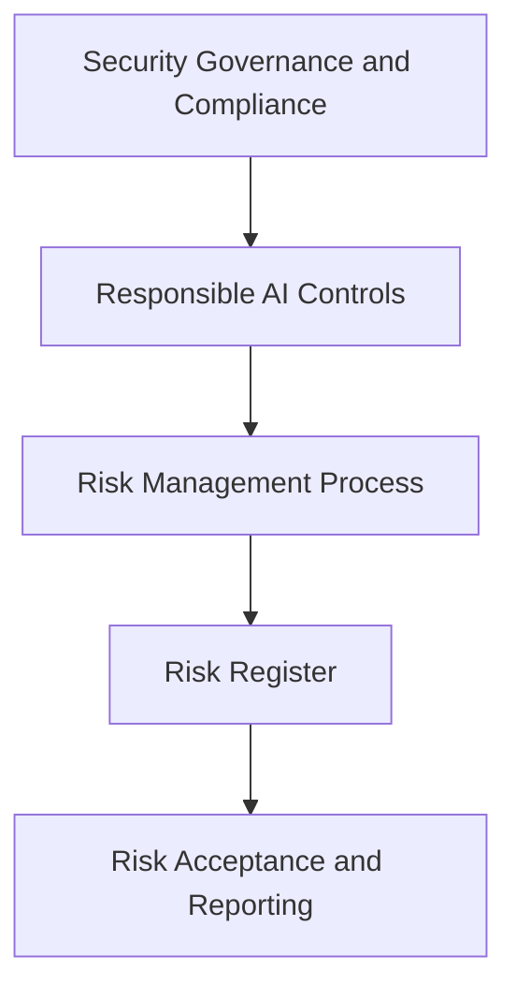

# Security and Risk Controls

# 7. Security, Governance, and Compliance Requirements

- Use least-privilege access for users, service principals, model
  endpoints, vector indexes, functions, tools, and storage locations.

- Use Unity Catalog privileges, IAM policies, workspace bindings, KMS
  encryption, secret management, and network controls to enforce data
  and model access boundaries.

- Classify sensitive data and prevent unauthorized exposure through row
  filters, column masks, retrieval-time permission checks, prompt
  redaction, and output guardrails.

- Apply AI safety controls including harmful-content filtering,
  hallucination mitigation, prompt-injection detection, tool allowlists,
  rate limits, and human-in-the-loop approvals.

- Maintain audit logs for data access, model invocation, agent tool use,
  prompt versions, deployment approvals, and production changes.

## 7.1 Responsible AI and Control Requirements

- AI systems must be designed to provide reliable, explainable, and
  reviewable outputs appropriate to the business context and risk level.

- Customer-impacting recommendations must include confidence handling,
  fallback behavior, escalation paths, and clear boundaries where human
  review is required.

- Agentic workflows must not execute irreversible, financial,
  customer-impacting, or operationally disruptive actions without
  explicit authorization and appropriate approval controls.

- Prompt injection, data exfiltration, unsafe tool execution,
  unauthorized retrieval, and hallucination risks must be assessed
  during design and tested before production release.

- Production systems must maintain sufficient logs and traces to support
  audit, incident investigation, quality review, and compliance
  reporting.

## 7.2 Security and Compliance Requirement Register

| ID | Requirement Statement | Control Owner | Verification Evidence |
|----|----|----|----|
| SR-001 | The system shall enforce least-privilege access across users, service principals, model endpoints, vector indexes, storage, tools, APIs, and logs. | Security Owner | Access review, entitlement test, and audit log sample. |
| SR-002 | The system shall encrypt sensitive data in transit and at rest using approved platform encryption and key-management controls. | Security Owner | Encryption configuration review and key ownership evidence. |
| SR-003 | The system shall prevent unauthorized exposure of sensitive data through classification, masking, redaction, permission-aware retrieval, output validation, and audit monitoring. | Data Owner | Data classification, masking test, retrieval authorization test, and output validation results. |
| SR-004 | Agentic workflows shall use tool allowlists, scoped credentials, execution limits, human approval for sensitive actions, and full tool-call traceability. | Security Owner | Tool registry review, approval workflow test, and trace sample. |
| SR-005 | Prompt injection, data exfiltration, unsafe output, and unauthorized tool execution risks shall be tested before production release. | Security Owner | Adversarial test report and remediation evidence. |

# 8. Risk Management Requirements

AI systems must include a formal risk management lifecycle that
identifies, classifies, assesses, mitigates, monitors, and reports risks
throughout design, development, deployment, and production operation.
Risk management must be integrated with architecture review, security
review, data governance, model evaluation, change management, and
incident response processes.

## 8.1 Risk Management Process

1.  Identify risks during business case development, architecture
    design, data onboarding, model selection, prompt design, agent tool
    definition, and production readiness review.

2.  Classify each risk by impact, likelihood, detectability, business
    domain, data sensitivity, customer exposure, operational
    criticality, and regulatory relevance.

3.  Define mitigation controls, control owners, residual risk level,
    validation evidence, and target remediation dates before production
    approval.

4.  Monitor production risk indicators including model quality drift,
    retrieval failures, unauthorized access attempts, prompt injection
    patterns, cost anomalies, endpoint failures, and user feedback
    trends.

5.  Escalate high and critical risks through enterprise governance,
    security, compliance, architecture, and operational leadership
    channels.

## 8.2 Enterprise AI Risk Register

| Risk Category | Risk Description | Required Mitigation | Primary Owner |
|----|----|----|----|
| Data Privacy and Confidentiality | Sensitive customer, employee, operational, or commercial data may be exposed through prompts, retrieval results, logs, model outputs, or tool responses. | Apply data classification, least privilege, masking, redaction, permission-aware retrieval, encryption, retention controls, and audit monitoring. | Data Owner and Security Owner |
| Hallucination and Incorrect Recommendations | The system may generate unsupported, outdated, inaccurate, or misleading answers that affect customer experience, store operations, pricing, inventory, or executive decisions. | Use grounded retrieval, source traceability, evaluation datasets, confidence thresholds, response validation, fallback behavior, and human escalation. | AI Product Owner and Model Owner |
| Prompt Injection and Tool Abuse | Malicious or unintended instructions may cause the system to ignore policies, expose data, call unauthorized tools, or perform unsafe actions. | Enforce system prompts, input filtering, tool allowlists, scoped credentials, execution limits, approval gates, output inspection, and adversarial testing. | Security Owner and Platform Owner |
| Model, Retrieval, and Data Drift | Model behavior, source data, embeddings, indexes, or retrieval quality may degrade over time due to changing products, pricing, inventory, policies, or customer behavior. | Monitor drift, freshness, retrieval hit rate, groundedness, regression tests, index refresh status, and business KPI movement. | Model Owner and Data Owner |
| Operational Reliability | AI endpoints, streaming pipelines, vector indexes, model services, or agent tools may become unavailable, slow, or inconsistent under production load. | Define SLOs, autoscaling, retries, timeouts, circuit breakers, fallback routing, queueing, disaster recovery, alerting, and runbooks. | Operations Owner and Platform Owner |
| Cost and Consumption Risk | Token usage, endpoint traffic, vector indexing, streaming workloads, or model inference may create unplanned cost growth. | Track cost per request, budget by use case, enforce quotas, rate limits, routing policies, usage dashboards, and anomaly alerts. | Business Owner and Platform Owner |
| Regulatory and Compliance Risk | AI decisions, data retention, audit evidence, or customer-facing outputs may fail to meet internal policy or external compliance expectations. | Maintain approval records, logs, traceability, retention controls, access reviews, policy mapping, and periodic compliance validation. | Compliance Owner and Security Owner |
| Adoption and Change Management Risk | Users may over-trust, under-use, misuse, or bypass AI capabilities if training, communication, and support are insufficient. | Provide user training, usage guidance, disclaimers where appropriate, feedback channels, support processes, and adoption measurement. | Business Owner and Change Owner |

## 8.3 Risk Acceptance and Reporting Requirements

- High and critical residual risks must have documented executive or
  delegated risk-owner acceptance before production deployment.

- Risk acceptance must include business justification, affected
  stakeholders, compensating controls, monitoring plan, expiration or
  review date, and remediation roadmap.

- Risk posture must be reviewed during major releases, model changes,
  prompt changes, data-source changes, endpoint scaling changes, and
  security control updates.

- Production risk reporting must include open risks, residual risk
  ratings, control effectiveness, unresolved incidents, policy
  exceptions, cost anomalies, and remediation status.

- Risk controls must be validated through test evidence, audit logs,
  tabletop exercises, incident simulations, adversarial testing, and
  production telemetry reviews.

## 8.4 Risk Requirement Register

| ID | Requirement Statement | Owner | Required Evidence |
|----|----|----|----|
| RR-001 | Every AI use case shall maintain a risk record that includes category, likelihood, impact, mitigation, residual risk, owner, review date, and acceptance status. | Risk Owner | Completed risk register entry. |
| RR-002 | High and critical risks shall require documented acceptance by an authorized executive or delegated risk owner before production release. | Executive Sponsor | Risk acceptance record and compensating-control plan. |
| RR-003 | Production risk indicators shall be monitored for access anomalies, prompt injection, quality drift, cost anomalies, endpoint failures, retrieval degradation, and user feedback trends. | Operations Owner | Risk dashboard, alert inventory, and monitoring review record. |
| RR-004 | Risk posture shall be reviewed during major releases, model changes, prompt changes, data-source changes, endpoint changes, and security-control changes. | Risk Owner | Release checklist and risk review approval. |

