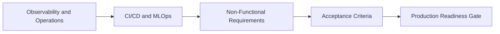

# Operations, Release, and Quality Gates

# 9. Evaluation, Observability, and Operational Requirements

- Every AI release must pass deterministic evaluation gates before
  promotion, including regression tests, golden-question tests,
  retrieval quality checks, safety tests, latency tests, and cost
  benchmarks.

- Use MLflow for experiment tracking, prompt/version management, trace
  collection, model evaluation, and production monitoring across agents,
  LLM applications, and ML models.

- Capture production telemetry including request volume, latency, token
  usage, model errors, retrieval hit rate, groundedness score, tool
  invocation success, user feedback, and cost per request.

- Use CloudWatch, Databricks system tables, logs, metrics, alerts, and
  dashboards to monitor platform health and trigger incident response
  workflows.

- Define SLOs for availability, p95 latency, answer quality, retrieval
  freshness, model error rate, and incident response time.

## 9.1 Operational Requirement Register

| ID | Requirement Statement | Owner | Evidence |
|----|----|----|----|
| OR-001 | Every production AI system shall define SLOs for availability, p95 latency, retrieval freshness, error rate, answer quality, and incident response time. | Operations Owner | SLO document and dashboard. |
| OR-002 | Every production release shall pass evaluation gates covering regression behavior, retrieval quality, safety, latency, cost, and failure scenarios. | Model Owner | Evaluation report and release approval. |
| OR-003 | Production telemetry shall capture request volume, latency, token usage, cost, model errors, retrieval hit rate, groundedness, tool success, and user feedback. | Operations Owner | Telemetry schema, dashboard, and sample logs. |
| OR-004 | Runbooks shall define triage steps, escalation paths, rollback procedures, known failure modes, alert thresholds, and communication expectations. | Operations Owner | Approved runbook and incident simulation result. |

# 10. CI/CD, MLOps, and Release Management Requirements

- All source code, prompts, agent definitions, tool contracts, model
  configurations, feature pipelines, infrastructure definitions, and
  evaluation datasets must be version controlled.

- Deployment pipelines must support dev, test, staging, and production
  promotion with automated validation and approval gates.

- Infrastructure must be provisioned through code using Terraform,
  Databricks Asset Bundles, AWS CDK, or equivalent enterprise-approved
  automation.

- Model and agent deployment must support rollback, canary release,
  shadow testing, traffic splitting, endpoint versioning, and
  champion/challenger evaluation.

- Production changes must include release notes, risk assessment,
  monitoring plan, rollback plan, and operational owner assignment.

## 10.1 Release Control Requirement Register

| ID | Requirement Statement | Owner | Evidence |
|----|----|----|----|
| RC-001 | All code, prompts, tool definitions, model configurations, data pipelines, infrastructure definitions, and evaluation datasets shall be version controlled. | Technical Owner | Repository review and artifact inventory. |
| RC-002 | Deployment pipelines shall enforce environment promotion, automated tests, approval gates, rollback capability, and change-record linkage. | Platform Engineer | Pipeline execution evidence and change record. |
| RC-003 | Model, prompt, agent, and tool changes shall be traceable to evaluation evidence, approval records, release notes, and production monitoring controls. | Model Owner | Version register, evaluation report, and approval history. |
| RC-004 | Production releases shall include rollback plan, risk review, monitoring plan, operational owner, and stakeholder communication plan. | Technical Owner | Release checklist and operational readiness approval. |

# 11. Non-Functional Requirements

| Category | Requirement |
|----|----|
| Scalability | Scale independently across ingestion, processing, vector search, model serving, and application layers. |
| Reliability | Support retry, timeout, circuit breaker, dead-letter handling, fallback model routing, and graceful degradation. |
| Performance | Meet defined p95 latency targets for retrieval, inference, and full response generation under expected production load. |
| Cost Control | Track cost by application, model, endpoint, user group, and workload; enforce budgets, quotas, and routing policies. |
| Maintainability | Use modular services, reusable tools, documented APIs, automated tests, and standardized runbooks. |

# 12. Acceptance Criteria

- The system demonstrates secure, governed access to enterprise data and
  AI assets across Databricks and AWS.

- RAG responses meet agreed quality thresholds for groundedness,
  retrieval relevance, latency, and source traceability.

- Agents can invoke only approved tools, respect policy constraints, and
  produce auditable traces for every tool action.

- Deployment pipelines can promote, roll back, and monitor model or
  agent versions without manual environment drift.

- Operations teams have dashboards, alerts, runbooks, and escalation
  paths for production incidents.

- Security and compliance stakeholders can review audit logs,
  permissions, data lineage, prompt versions, model versions, and
  endpoint activity.

## 12.1 Production Readiness Gate

| Readiness Domain | Minimum Exit Criteria |
|----|----|
| Architecture | Approved architecture diagram, integration contracts, dependency map, and failure-mode analysis. |
| Security | Approved access model, secrets handling, encryption controls, audit logging, and threat mitigation plan. |
| Data | Approved data contracts, lineage, quality checks, classification, retention expectations, and retrieval governance. |
| AI Quality | Documented evaluation results for model quality, retrieval quality, safety, latency, cost, and regression behavior. |
| Operations | Dashboards, alerts, runbooks, escalation paths, rollback procedure, support ownership, and incident response process. |
| Business | Defined KPIs, expected value, adoption plan, training plan, success measurement cadence, and stakeholder approval. |

## 12.2 Acceptance Verification Matrix

| ID | Acceptance Criterion | Verification Method | Required Approver |
|----|----|----|----|
| AC-001 | Security and governance controls are implemented and verified for data, models, endpoints, retrieval indexes, agents, and tool execution. | Security test, access review, audit log inspection, and governance review. | Security Owner and Data Owner |
| AC-002 | RAG, model, and agent quality meet approved thresholds for groundedness, accuracy, latency, safety, cost, and regression behavior. | Evaluation report, golden test set, load test, and quality dashboard. | Model Owner and Business Product Owner |
| AC-003 | Operational readiness is complete with SLOs, dashboards, alerts, runbooks, rollback plan, incident response process, and support ownership. | Operational readiness review and incident simulation. | Operations Owner |
| AC-004 | Business readiness is complete with KPI baseline, adoption plan, training plan, value measurement cadence, and stakeholder approval. | Business readiness review and KPI dashboard validation. | Business Product Owner |
| AC-005 | Cost readiness is complete with forecast, budget, cost-per-request target, anomaly alerts, utilization dashboard, and optimization backlog. | FinOps review and budget approval. | Cost Owner and Business Product Owner |

## 12.3 Detailed Acceptance Criteria Examples

The following examples illustrate how acceptance criteria should be
written for enterprise AI capabilities. Each criterion must be testable,
evidence-based, tied to a requirement ID, and approved by the
accountable owner before production release.

| Example ID | Capability Area | Acceptance Criteria Example | Verification Evidence | Approver |
|----|----|----|----|----|
| AC-EX-001 | RAG Answer Grounding | For the approved golden-question test set, responses shall meet the agreed groundedness threshold, include source-aware reasoning where required, and must not introduce unsupported claims outside retrieved context. | Golden-question evaluation report, sampled response review, retrieval trace, source coverage report. | Model Owner and Data Owner |
| AC-EX-002 | Permission-Aware Retrieval | A user shall only retrieve documents, table records, metadata, embeddings, or source snippets that the user is authorized to access through the approved enterprise access model. | Positive and negative authorization tests, audit log sample, Unity Catalog or IAM permission review. | Security Owner and Data Owner |
| AC-EX-003 | Agent Tool Execution | Agents shall invoke only approved tools, use scoped credentials, stop at the maximum configured step count, and require approval before executing sensitive or customer-impacting actions. | Tool registry review, agent trace sample, approval workflow test, negative test for unauthorized tool access. | Security Owner and Technical Owner |
| AC-EX-004 | Model Quality Regression | A new model, prompt, retrieval strategy, or agent version shall not be promoted if it materially degrades approved quality metrics, safety behavior, latency, or cost compared with the current production baseline. | Regression evaluation report, baseline comparison, release approval checklist, rollback plan. | Model Owner |
| AC-EX-005 | Retail Tire Recommendation | The tire recommendation workflow shall return fitment-compatible recommendations based on vehicle attributes, product availability, customer intent, and approved product data; uncertain or incomplete fitment cases shall be escalated or routed to a human-assisted workflow. | Fitment test set, product data validation, sample recommendation review, escalation workflow test. | Business Product Owner and Data Owner |
| AC-EX-006 | Store Operations Copilot | The associate or technician copilot shall answer only from approved SOPs, product knowledge, warranty rules, and service guidance; it must clearly decline or escalate when the requested action is outside policy or available context. | SOP retrieval test, policy compliance review, user acceptance test, escalation test. | Business Product Owner and Security Owner |
| AC-EX-007 | Inventory Optimization | Inventory recommendations shall identify demand, stockout, transfer, and replenishment signals using governed source data and must provide explainable drivers before being used for operational decision support. | Forecast backtest, data quality report, recommendation sample review, business KPI dashboard. | Business Product Owner and Data Owner |
| AC-EX-008 | Cost Readiness | The AI application shall have a documented monthly forecast, cost-per-request target, token budget, endpoint utilization dashboard, and anomaly alert thresholds before production approval. | FinOps review, budget approval, cost dashboard, token usage test, anomaly alert test. | Cost Owner and Business Product Owner |
| AC-EX-009 | Operational Readiness | The system shall demonstrate successful monitoring, alerting, incident triage, rollback, and escalation through a production-readiness simulation before go-live. | Incident simulation record, alert test, runbook review, rollback evidence, support handoff approval. | Operations Owner |
| AC-EX-010 | Security and Auditability | Every production request shall produce sufficient audit evidence to identify user or service identity, request category, model or endpoint used, retrieval sources, tool calls, policy decisions, and response status. | Audit log sample, trace sample, telemetry schema review, security review signoff. | Security Owner and Operations Owner |

### 12.3.1 Acceptance Criteria Writing Checklist

- State the requirement in observable pass/fail language.

- Reference the related requirement ID, risk ID, or control ID.

- Define the verification method, evidence artifact, and accountable
  approver.

- Include quantitative thresholds where the metric is known; otherwise
  define the approval process for establishing the threshold.

- Include negative tests for unauthorized access, unsupported prompts,
  unsafe tool execution, missing context, and failure recovery.

- Confirm the criterion can be validated before production release and
  monitored after release.

