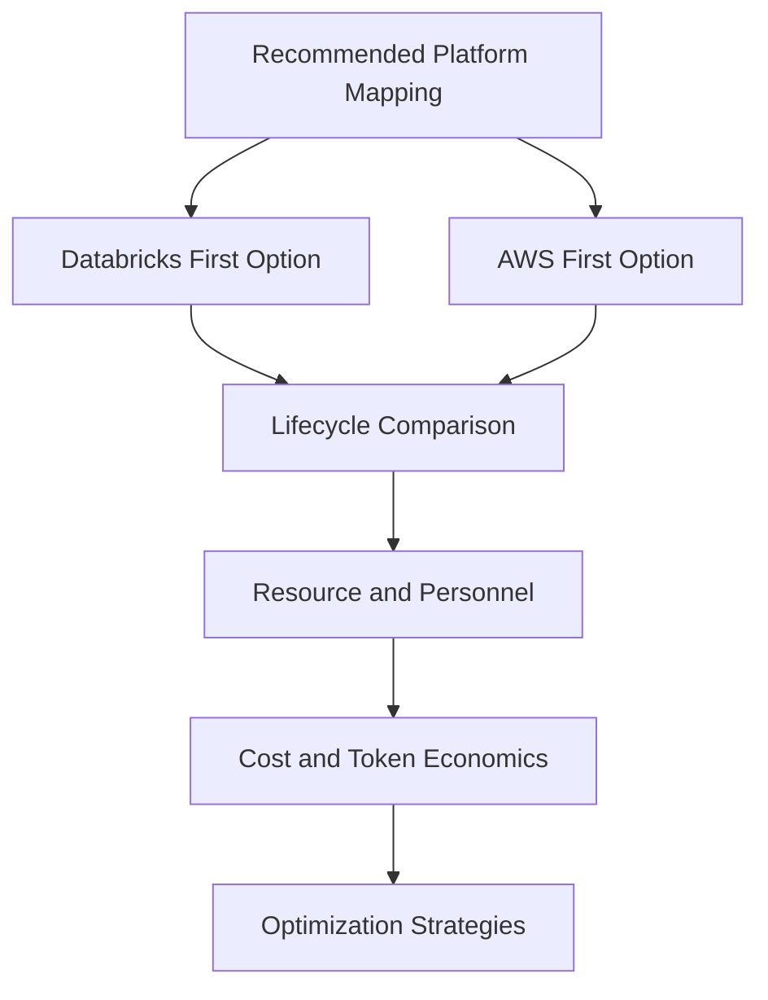

# Platform Mapping and Cost Strategy

# 13. Recommended Platform Mapping

| Capability | Databricks Option | AWS Option |
|----|----|----|
| Governance | Unity Catalog, system tables, lineage, tags, data classification | IAM, Lake Formation, Glue Catalog, CloudTrail, KMS |
| Model and Agent Serving | Mosaic AI Model Serving, Agent Framework, Databricks Apps | Amazon Bedrock, Bedrock Agents or AgentCore, Lambda, API Gateway |
| RAG and Vector Search | Vector Search, AI Search, Delta Lake, MLflow evaluation | Bedrock Knowledge Bases, OpenSearch Serverless, S3 |
| Streaming | Spark Structured Streaming, Delta Live Tables, Workflows | Amazon MSK, Managed Service for Apache Flink, Kinesis |
| Observability | MLflow tracing, Databricks monitoring, system tables | CloudWatch, CloudTrail, X-Ray, Bedrock invocation logs |

# 14. Databricks-First versus AWS-First Option Comparison

This section compares two implementation options for the enterprise AI
system: a Databricks-first option that centers the AI lifecycle around
the Databricks Lakehouse and Mosaic AI capabilities, and an AWS-first
option that centers the AI lifecycle around Amazon Bedrock, AWS-native
orchestration, AWS data services, and AWS operational tooling.

## 14.1 Executive Comparison Summary

| Comparison Dimension | Option A: Databricks-First | Option B: AWS-First | Enterprise Assessment |
|----|----|----|----|
| Best Fit | Best when governed enterprise data, Delta Lake, Unity Catalog, MLflow, data engineering, BI, and AI development are already concentrated in Databricks. | Best when AWS-native services, Bedrock, OpenSearch, Lambda, API Gateway, MSK, Flink, IAM, and CloudWatch are the dominant operating model. | Databricks-first generally accelerates AI use cases grounded in lakehouse data; AWS-first generally accelerates cloud-native application and service integration. |
| Strategic Advantage | Unified data, AI, governance, evaluation, lineage, and deployment experience in one platform. | Broad managed-service ecosystem with deep integration into AWS security, networking, compute, and operational tooling. | The preferred option should align to where enterprise data, skills, governance, and production ownership already exist. |
| Primary Tradeoff | May depend on Databricks platform maturity, workspace governance, DBU consumption management, and integration with AWS-native services. | May require more integration work across services for data governance, AI evaluation, lineage, prompt/version control, and end-to-end lifecycle management. | Databricks-first reduces AI/data lifecycle fragmentation; AWS-first increases cloud-native flexibility but can increase architecture assembly complexity. |

## 14.2 Development Lifecycle Comparison

| Lifecycle Area | Databricks-First | AWS-First |
|----|----|----|
| Discovery and Data Readiness | Strong fit for use cases that depend on governed Delta tables, Unity Catalog permissions, lineage, feature tables, and existing Databricks pipelines. | Strong fit when source data and integration points are already organized around AWS services such as S3, Glue, MSK, Flink, OpenSearch, Lambda, and API Gateway. |
| Prototype and Experimentation | Faster for data-centric AI because notebooks, SQL, MLflow, Vector Search, model serving, and evaluation can be used within a common workspace. | Faster for service-centric GenAI because Bedrock provides managed foundation model access, agents, guardrails, and knowledge-base capabilities through AWS APIs. |
| Build and Integration | Lower integration effort for lakehouse-native RAG, ML, feature serving, model evaluation, and governed AI apps. | Lower integration effort for AWS-native APIs, serverless workflows, event-driven applications, security controls, and application deployment pipelines. |
| Testing and Evaluation | Stronger built-in lifecycle alignment through MLflow tracing, evaluation, prompt and app versioning, production monitoring, and Unity Catalog governance. | Requires composition of Bedrock evaluation, CloudWatch, CloudTrail, X-Ray, application logs, custom evaluation pipelines, and third-party or internal quality tooling. |
| Release and Promotion | Well suited for Databricks Asset Bundles, workspace promotion, MLflow model registry, serving endpoint promotion, and lakehouse release governance. | Well suited for AWS CDK or Terraform, CodePipeline, Lambda/ECS/EKS deployment, IAM policies, Bedrock configuration promotion, and API Gateway releases. |
| Production Monitoring | Strong for AI quality, data lineage, model traces, feature usage, endpoint telemetry, and lakehouse-driven cost attribution. | Strong for infrastructure health, service logs, API telemetry, security events, cloud operations, and multi-service AWS monitoring. |

## 14.3 Resource and Personnel Summary

| Role / Skill Area | Databricks-First Resource Profile | AWS-First Resource Profile |
|----|----|----|
| Enterprise Architect | Defines lakehouse-centric architecture, governance patterns, workspace strategy, data product boundaries, and Databricks-to-AWS integration model. | Defines AWS service architecture, network/security boundaries, service integration patterns, event-driven workflows, and Bedrock operating model. |
| Data Engineer | High demand for Delta Lake, Spark, streaming, Databricks workflows, Unity Catalog, feature pipelines, and data quality engineering. | High demand for S3, Glue, MSK, Flink, Lambda, OpenSearch ingestion, event schemas, and AWS-native data pipelines. |
| AI / ML Engineer | Focuses on Mosaic AI, MLflow, Model Serving, Vector Search, feature serving, agent evaluation, and governed experiment management. | Focuses on Bedrock model selection, agents, knowledge bases, guardrails, prompt routing, OpenSearch vector stores, and serverless AI orchestration. |
| Platform Engineer | Manages Databricks workspaces, clusters, serverless policies, endpoint configuration, Asset Bundles, secrets, and cost controls. | Manages AWS accounts, IAM, VPCs, API Gateway, Lambda, ECS/EKS, Bedrock access, CloudWatch, KMS, and service quotas. |
| Security / Governance | Prioritizes Unity Catalog permissions, lineage, data classification, serving endpoint controls, MLflow trace governance, and workspace access. | Prioritizes IAM, KMS, CloudTrail, Lake Formation, VPC endpoints, service control policies, Bedrock guardrails, and cross-service auditability. |
| Operations / SRE | Monitors Databricks workflows, serving endpoints, MLflow metrics, system tables, job failures, DBU consumption, and data freshness. | Monitors CloudWatch metrics, Bedrock invocations, Lambda/API failures, MSK/Flink health, OpenSearch capacity, alarms, and service quotas. |

## 14.4 Total Return of Cost Comparison

| Return Dimension | Databricks-First Return Profile | AWS-First Return Profile |
|----|----|----|
| Time to Business Value | Higher return when use cases depend on enterprise lakehouse data, existing Databricks pipelines, MLflow evaluation, and governed BI/AI assets. | Higher return when use cases depend on rapid AWS service integration, Bedrock model access, existing serverless applications, and cloud-native APIs. |
| Reuse of Existing Investments | Maximizes prior investment in Delta Lake, Unity Catalog, Databricks workflows, MLflow, feature engineering, and lakehouse operating standards. | Maximizes prior investment in AWS accounts, IAM, networking, MSK, Flink, OpenSearch, Lambda, API Gateway, CloudWatch, and existing DevOps patterns. |
| Quality and Governance Return | Strong return from unified governance, lineage, traceability, evaluation, and source-aware AI lifecycle management. | Strong return from AWS-native security, audit, monitoring, managed AI services, and service-level scalability. |
| Innovation Velocity | Accelerates data and AI teams by keeping development, evaluation, deployment, and monitoring close to governed enterprise data. | Accelerates application and cloud engineering teams by enabling service-oriented AI applications with managed model access and serverless integration. |
| Risk-Adjusted Return | Lower risk for governed data-centric AI if Databricks controls, workspace policies, and cost attribution are mature. | Lower risk for cloud-native applications if AWS security, network, monitoring, and service ownership models are already mature. |

## 14.5 System Cost Summary

| Cost Area | Databricks-First Cost Drivers | AWS-First Cost Drivers |
|----|----|----|
| Core Platform | DBU consumption for jobs, SQL, streaming, model serving, serverless compute, vector search, and interactive development; underlying cloud storage and networking may also apply depending on workload type. | AWS service consumption across Bedrock inference, agents, knowledge bases, OpenSearch, Lambda, API Gateway, ECS/EKS, MSK, Flink, S3, Glue, CloudWatch, and data transfer. |
| Model Inference | Model serving compute, provisioned concurrency, GPU or CPU endpoint sizing, pay-per-token endpoints where applicable, and endpoint idle-time configuration. | Bedrock input and output tokens, model tier, provisioned throughput, batch inference, guardrails, prompt routing, agent orchestration, and retrieved context size. |
| RAG and Vector Search | Vector index storage, endpoint capacity, embedding jobs, Delta table sync, reranking, and retrieval query volume. | OpenSearch Serverless or managed cluster compute and storage, embedding model usage, knowledge-base ingestion, query volume, and index refresh frequency. |
| Streaming and Data Processing | Databricks streaming jobs, structured streaming clusters, workflows, Delta storage, and checkpointing. | MSK broker capacity, Flink KPUs, Kinesis where used, Lambda processing, S3 storage, Glue catalog, and downstream OpenSearch indexing. |
| Governance and Observability | Unity Catalog governance operations, system tables, MLflow tracing, evaluation jobs, dashboard queries, logs, and endpoint telemetry storage. | CloudWatch metrics/logs, CloudTrail, X-Ray, GuardDuty/Security Hub where applicable, Bedrock invocation logs, OpenSearch monitoring, and custom evaluation pipelines. |

## 14.6 Operational Cost Summary

| Operational Area | Databricks-First Operational Cost | AWS-First Operational Cost |
|----|----|----|
| Platform Administration | Moderate when centralized Databricks workspace, cluster, endpoint, Unity Catalog, and cost-policy governance are already mature. | Moderate to high depending on the number of AWS services, accounts, IAM boundaries, networking patterns, and service quotas involved. |
| Incident Response | Lower for Databricks-native job, model, vector search, and data quality incidents when telemetry is centralized in Databricks and MLflow. | Lower for AWS infrastructure and service incidents when CloudWatch, CloudTrail, X-Ray, and AWS operational practices are already standardized. |
| FinOps | Requires strong DBU attribution, endpoint usage tracking, workload tagging, job optimization, scale-to-zero policies, and compute right-sizing. | Requires multi-service cost attribution across Bedrock tokens, OpenSearch capacity, MSK/Flink resources, Lambda/API Gateway traffic, logs, and data transfer. |
| Security Operations | Focused on workspace access, Unity Catalog privileges, endpoint permissions, model trace visibility, secret scopes, and data lineage. | Focused on IAM policies, KMS keys, VPC endpoints, Bedrock access controls, service control policies, CloudTrail, Guardrails, and cross-service audit correlation. |
| Runbook Complexity | Lower for lakehouse-native use cases because data, AI assets, workflows, and evaluations are managed in fewer control planes. | Higher when the solution spans many AWS services, but lower for teams already operating production-grade AWS serverless and event-driven systems. |

## 14.7 Recommendation and Decision Criteria

For a retail AI system where the highest-value use cases depend on
governed enterprise data, lakehouse analytics, feature engineering, RAG
over curated data products, model evaluation, and executive KPI
intelligence, the recommended primary option is **Databricks-first with
AWS-native integration**. This approach should use Databricks as the
governed data and AI lifecycle control plane while using AWS for Bedrock
models where appropriate, MSK and Flink streaming, S3 storage,
OpenSearch where required, CloudWatch monitoring, IAM/KMS security, and
application integration services.

- Select **Databricks-first** when data governance, AI evaluation,
  traceability, RAG quality, and lakehouse-native analytics are the
  primary success factors.

- Select **AWS-first** when cloud-native application integration,
  Bedrock-centric model access, serverless deployment, and AWS
  operational standardization are the primary success factors.

- Select a **hybrid operating model** when Databricks owns governed data
  and AI lifecycle management while AWS owns event streaming, foundation
  model access, service APIs, infrastructure operations, and enterprise
  cloud controls.

- Require a cost model before implementation that estimates Databricks
  DBU usage, model serving usage, Bedrock token usage, vector index
  cost, streaming cost, storage cost, observability cost, and
  operational staffing cost.

## 14.8 Token Cost Comparison

Token cost must be modeled as a workload-specific consumption pattern
rather than a single platform price. Both Databricks-first and AWS-first
implementations may charge differently by model, input tokens, output
tokens, provisioned throughput, batch inference, endpoint capacity,
retrieved context size, guardrail execution, agent orchestration, and
observability retention.

| Token Cost Dimension | Databricks-First Cost Behavior | AWS-First Cost Behavior | Enterprise Control Requirement |
|----|----|----|----|
| Billing Unit | Foundation Model APIs can use pay-per-token pricing for supported models or provisioned throughput for production workloads; custom model serving may also consume endpoint compute capacity. | Amazon Bedrock commonly bills by model-specific input and output tokens, with additional billing modes such as batch inference, provisioned throughput, guardrails, agents, and knowledge-base usage. | The cost model must separate model token cost from endpoint, vector, orchestration, logging, and platform infrastructure cost. |
| Input Tokens | Input cost increases with system prompts, user prompts, retrieved context, conversation history, tool schemas, and few-shot examples passed through Databricks model endpoints. | Input cost increases with Bedrock prompt size, retrieved Knowledge Base context, agent instructions, tool/action schemas, conversation history, and guardrail evaluation context. | Prompt templates must define maximum context size, retrieval limits, summarization rules, and conversation-window truncation. |
| Output Tokens | Output cost increases with long-form responses, reasoning-heavy tasks, verbose summaries, generated reports, and multi-step assistant responses. | Output cost increases with generated responses from Bedrock models; output tokens are typically more expensive than input tokens for many frontier models. | Applications must enforce response-length controls, task-specific answer formats, and concise default response policies. |
| RAG Token Amplification | RAG workloads add token cost through retrieved chunks, metadata, reranked passages, source summaries, and grounding instructions sent to the model. | RAG workloads add token cost through Knowledge Base retrieval, OpenSearch-backed context, citations, guardrails, and additional model calls for reranking or summarization. | RAG pipelines must tune chunk size, top-k retrieval, metadata filters, reranking thresholds, and context compression before production release. |
| Agent Token Amplification | Agentic workflows may multiply token usage through planning, tool selection, tool results, retries, reflection steps, and trace generation. | Bedrock agent workflows may multiply token usage through orchestration, action groups, repeated model calls, guardrails, retrieved context, and tool-response loops. | Agents must have maximum step count, timeout limits, retry limits, tool allowlists, and cost-per-task thresholds. |
| Provisioned Capacity | Provisioned throughput can improve production predictability but may introduce fixed hourly capacity cost if underutilized. | Provisioned throughput can support predictable Bedrock production traffic but may create commitment-based cost if demand is lower than expected. | Production workloads must compare pay-per-token, batch, and provisioned-capacity economics before committing capacity. |
| Batch Inference | Batch inference may reduce operational complexity for scheduled summarization, classification, and enrichment workloads when latency is not interactive. | Bedrock batch inference can reduce inference cost for asynchronous workloads where near-real-time response is not required. | Batch workloads must be separated from interactive workloads and routed to the lowest-cost acceptable execution mode. |
| Cost Attribution | Attribution should include workspace, serving endpoint, application, model, user group, job, Databricks workload tags, token metrics, and downstream storage or monitoring cost. | Attribution should include AWS account, Bedrock model, agent, knowledge base, OpenSearch collection, Lambda/API route, application, tenant, and CloudWatch usage. | Every production AI application must report cost by use case, model, endpoint, business owner, and request category. |

### 14.8.1 Token Cost Estimation Formula

The baseline token cost estimate should use the following planning
model: monthly token cost equals monthly request volume multiplied by
average input tokens per request multiplied by the selected model
input-token rate, plus monthly request volume multiplied by average
output tokens per request multiplied by the selected model output-token
rate. The estimate must then add non-token costs such as vector search,
embedding generation, endpoint capacity, agent orchestration,
guardrails, logging, monitoring, data transfer, and operational support.

### 14.8.2 Token Cost Control Requirements

- Every production AI use case must define a target cost per request,
  monthly token budget, and maximum allowed token growth threshold.

- Applications must log input tokens, output tokens, total tokens, model
  name, endpoint name, request category, user group, latency, and
  business use case.

- RAG applications must track retrieved chunk count, retrieved context
  token size, answer length, retrieval hit rate, groundedness, and cost
  per grounded response.

- Agentic applications must track model calls per task, tool calls per
  task, retries, failed tool executions, orchestration steps, and cost
  per completed workflow.

- Routing policies should use smaller or lower-cost models for
  classification, extraction, summarization, and routine Q&A while
  reserving premium models for complex reasoning, high-risk decisions,
  or executive workflows.

- Cost anomaly alerts must be triggered when token volume, output
  length, agent step count, retrieval context size, endpoint traffic, or
  model routing distribution exceeds defined thresholds.

- Monthly FinOps review must compare forecasted token spend, actual
  token spend, cost per business outcome, quality metrics, and
  optimization opportunities.

## 14.9 Cost Optimization Strategies

Cost optimization must be treated as an engineering discipline across
the full AI system lifecycle. Optimization decisions must balance cost,
latency, quality, safety, availability, and business value rather than
minimizing spend in isolation.

| Optimization Area | Databricks-First Strategy | AWS-First Strategy | Required Control |
|----|----|----|----|
| Model Routing | Route simple tasks to lower-cost endpoints or smaller models; reserve premium models for complex reasoning, executive workflows, or high-risk tasks. | Use Bedrock model tiering, prompt routing, and task classification to select the lowest-cost model that satisfies quality and latency requirements. | Maintain a model routing policy with quality thresholds, fallback logic, and cost-per-request targets. |
| Prompt and Context Optimization | Minimize system prompts, few-shot examples, conversation history, and retrieved context passed to Databricks model endpoints. | Minimize Bedrock prompt size, agent instructions, tool schemas, retrieved Knowledge Base passages, and guardrail evaluation scope where appropriate. | Define maximum input-token budgets by use case, persona, channel, and response type. |
| RAG Optimization | Tune chunk size, embedding refresh frequency, top-k retrieval, metadata filters, reranking, and Vector Search endpoint sizing. | Tune Knowledge Base retrieval count, OpenSearch index design, embedding model selection, refresh cadence, and reranking strategy. | Measure retrieval quality, context-token size, groundedness, and cost per grounded answer before production approval. |
| Agent Workflow Optimization | Limit planning loops, tool calls, retries, reflection steps, and intermediate trace verbosity for Mosaic AI agent workflows. | Limit Bedrock agent orchestration steps, action group retries, tool-response payload size, and repeated model invocations. | Set maximum agent steps, timeout limits, retry limits, and cost-per-completed-task thresholds. |
| Compute Rightsizing | Right-size jobs, warehouses, serving endpoints, clusters, and serverless workloads; use scale-to-zero where latency requirements allow. | Right-size Lambda memory, ECS/EKS capacity, OpenSearch capacity, MSK brokers, Flink KPUs, and Bedrock provisioned throughput. | Review utilization, idle time, p95 latency, saturation, and cost trend monthly. |
| Batch versus Real-Time Execution | Use scheduled batch jobs for summarization, enrichment, embedding refresh, and offline evaluation when interactive latency is not required. | Use Bedrock batch inference, scheduled Lambda/ECS jobs, and asynchronous workflows for non-interactive workloads. | Classify workloads as interactive, near-real-time, scheduled batch, or offline before implementation. |
| Streaming Cost Optimization | Optimize Spark Structured Streaming trigger intervals, checkpointing, state size, partitioning, and autoscaling policies. | Optimize MSK partition count, broker sizing, retention, Flink parallelism, KPU usage, checkpointing, and backpressure handling. | Define throughput targets, freshness SLOs, lag thresholds, and utilization targets for each streaming workload. |
| Storage and Log Retention | Apply Delta optimization, table lifecycle policies, log retention limits, trace sampling, and tiered storage where applicable. | Apply S3 lifecycle policies, CloudWatch log retention, OpenSearch index lifecycle management, and trace sampling. | Define retention policies for prompts, responses, traces, logs, embeddings, indexes, and evaluation artifacts. |
| Observability Cost Optimization | Use targeted tracing, metric aggregation, sampling, dashboard query optimization, and system table cost attribution. | Use CloudWatch metric filters, log sampling, X-Ray sampling, aggregated dashboards, and anomaly-based alerting. | Separate mandatory audit telemetry from optional debug telemetry and apply different retention policies. |
| FinOps Governance | Use workload tags, endpoint tags, budget alerts, DBU attribution, owner mapping, and monthly optimization reviews. | Use AWS cost allocation tags, budgets, cost anomaly detection, service quotas, account-level guardrails, and owner mapping. | Each AI use case must have a business owner, cost owner, budget, forecast, utilization dashboard, and optimization backlog. |

### 14.9.1 Cost Optimization Implementation Checklist

- Define cost-per-request targets before development begins and validate
  them during load testing.

- Separate interactive, batch, streaming, evaluation, and administrative
  workloads into distinct cost categories.

- Implement model routing rules that use lower-cost models for simple
  tasks and premium models only when justified by quality or risk
  requirements.

- Limit retrieved context size, agent step count, retry behavior, output
  length, and conversation history by default.

- Apply tagging standards for application, environment, business owner,
  technical owner, model, endpoint, workload, and cost center.

- Review idle resources, endpoint utilization, streaming resource
  utilization, vector index capacity, and log retention monthly.

- Use anomaly alerts for sudden increases in token volume, DBU
  consumption, Bedrock spend, OpenSearch capacity, MSK/Flink usage,
  CloudWatch logs, and data transfer.

- Maintain a prioritized optimization backlog with estimated savings,
  engineering effort, risk impact, and business owner approval.

