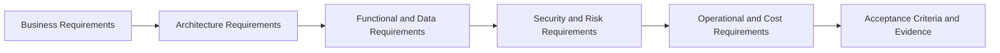

# Enterprise Traceability Matrix

# 15. Enterprise Traceability Matrix

| Traceability Domain | Requirement IDs | Primary Controls | Evidence Artifacts |
|----|----|----|----|
| Business Value | BR-001 to BR-004 | Use-case charter, KPI baseline, value scorecard, adoption plan. | Business case, KPI dashboard, benefit realization review. |
| Architecture | AR-001 to AR-004 | Layered architecture, platform mapping, integration contracts, architecture decision records. | Approved architecture diagram, dependency map, design review approval. |
| Functional Capability | FR-001 to FR-005 | Model access, RAG, agents, feature serving, application/API access. | Functional test results, API tests, tool tests, endpoint tests. |
| Data and Retrieval | DR-001 to DR-004 | Data contracts, catalog registration, lineage, retrieval evaluation, freshness monitoring. | Data quality report, retrieval test, authorization test, freshness dashboard. |
| Security and Compliance | SR-001 to SR-005 | Least privilege, encryption, masking, guardrails, adversarial testing, audit logging. | Security review, access review, penetration/adversarial test, audit sample. |
| Risk Management | RR-001 to RR-004 | Risk register, residual risk acceptance, mitigation plans, production risk monitoring. | Risk report, acceptance record, monitoring dashboard, remediation backlog. |
| Operations | OR-001 to OR-004 | SLOs, dashboards, alerts, runbooks, incident simulation, rollback plan. | Operational readiness approval and incident simulation result. |
| Release Control | RC-001 to RC-004 | Version control, CI/CD gates, release approval, rollback, change-record linkage. | Pipeline evidence, release notes, approval record, rollback test. |
| Acceptance | AC-001 to AC-005 | Security, quality, operations, business, and cost readiness gates. | Signed readiness checklist and production approval. |
