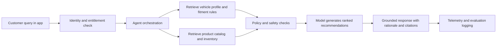
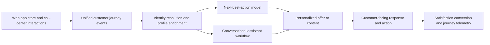
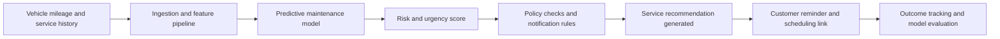
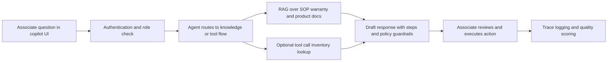
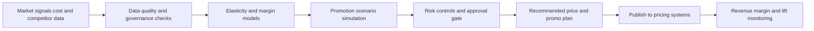

# AI Workflow Use-Case Diagrams

This document adds workflow diagrams for the major business use cases defined in the reference system specification.

## Interactive Workflow Map

Select a workflow node to jump to the detailed use-case chart in this file.

```mermaid
flowchart TB
  A[Retail AI Workflow Hub]

  A --> U1[1. Tire Recommendation and Fitment]
  A --> U2[2. Store Throughput Optimization]
  A --> U3[3. Inventory and Replenishment]
  A --> U4[4. Omnichannel Experience]
  A --> U5[5. Proactive Service Assistant]
  A --> U6[6. Associate and Technician Copilot]
  A --> U7[7. Dynamic Pricing and Promotions]
  A --> U8[8. Supply Chain Resilience]
  A --> U9[9. Operational Command Center]

  click U1 "#1-ai-powered-tire-recommendation-and-fitment-advisor" "Go to use case 1"
  click U2 "#2-store-service-throughput-optimization" "Go to use case 2"
  click U3 "#3-ai-driven-inventory-and-replenishment-optimization" "Go to use case 3"
  click U4 "#4-omnichannel-customer-experience-intelligence" "Go to use case 4"
  click U5 "#5-proactive-vehicle-and-tire-service-assistant" "Go to use case 5"
  click U6 "#6-ai-assisted-store-associate-and-technician-copilot" "Go to use case 6"
  click U7 "#7-dynamic-pricing-promotion-and-margin-optimization" "Go to use case 7"
  click U8 "#8-supply-chain-resilience-and-logistics-optimization" "Go to use case 8"
  click U9 "#9-operational-command-center-for-retail-intelligence" "Go to use case 9"
```

## 1. AI-Powered Tire Recommendation and Fitment Advisor

## 2. Store Service Throughput Optimization

```mermaid
flowchart LR
  A[Appointment and bay events] --> B[Streaming ingestion MSK]
  B --> C[Streaming compute Flink or Spark]
  C --> D[Feature updates and queue state]
  D --> E[Scheduling optimization model]
  E --> F[Recommended staffing and bay plan]
  F --> G[Supervisor review for execution]
  G --> H[Dispatch updates to store systems]
  H --> I[Operational metrics and feedback loop]
```

## 3. AI-Driven Inventory and Replenishment Optimization

```mermaid
flowchart LR
  A[Sales demand and stock feeds] --> B[Batch and streaming pipelines]
  B --> C[Forecasting features and seasonality signals]
  C --> D[Demand forecasting and replenishment model]
  D --> E[Transfer and reorder recommendations]
  E --> F[Constraint and policy checks]
  F --> G[Planner approval workflow]
  G --> H[ERP and replenishment execution]
  H --> I[Cost and service-level monitoring]
```

## 4. Omnichannel Customer Experience Intelligence

## 5. Proactive Vehicle and Tire Service Assistant

## 6. AI-Assisted Store Associate and Technician Copilot

## 7. Dynamic Pricing Promotion and Margin Optimization

## 8. Supply Chain Resilience and Logistics Optimization

```mermaid
flowchart LR
  A[Supplier logistics and store demand events] --> B[Streaming and batch harmonization]
  B --> C[ETA risk and exception detection models]
  C --> D[Route and allocation optimization]
  D --> E[Priority replenishment recommendations]
  E --> F[Operations approval and dispatch]
  F --> G[Execution in logistics systems]
  G --> H[Service-level and delay analytics]
```

## 9. Operational Command Center for Retail Intelligence

```mermaid
flowchart LR
  A[Cross-domain KPI telemetry] --> B[Real-time aggregation and anomaly detection]
  B --> C[Agentic BI question understanding]
  C --> D[Governed retrieval across sales service inventory]
  D --> E[Root-cause reasoning and summary generation]
  E --> F[Executive dashboard narrative and actions]
  F --> G[Decision capture and follow-up tasks]
  G --> H[Outcome measurement and continuous learning]
```

## Cross-Cutting Controls Applied to All Workflows

- Identity and entitlement checks before data retrieval or tool execution.
- Guardrails for safety, compliance, and sensitive-action approvals.
- Traceability for prompts, retrieval context, model outputs, and tool calls.
- Evaluation and cost telemetry written to observability and operations systems.
